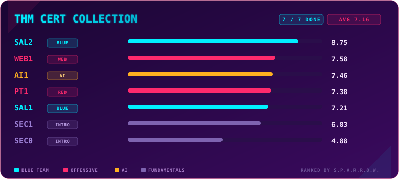

---

## What this is

After Action Reports on TryHackMe professional certifications. Not marketing copy, not a portal-style review. Each one covers what the exam actually tested, how it went, where it fell short, and an honest score. The set is now complete: all 7 certifications reviewed, plus two summary reviews, one from the perspective of someone earning the certs, one from the perspective of someone hiring for them.

**Use code `KAROL20` on any [certification](https://tryhackme.com/certifications) or on [BUNDLES](https://tryhackme.com/certifications?view=bundles) for 20% off**

## Methodology: S.P.A.R.R.O.W. Score

Every cert in this series is scored on the same 7-dimension scale, so the results stay comparable.

| Letter | Dimension    | What it measures                                                                                                                                                                            |
| ------ | ------------ | ------------------------------------------------------------------------------------------------------------------------------------------------------------------------------------------- |
| **S**  | Scope        | Does the cert's actual coverage match what it advertises up front                                                                                                                           |
| **P**  | Practicality | Do the scenarios reflect real work, or are they gamified filler                                                                                                                             |
| **A**  | Access       | Is the prep material (course/learning path) good enough to get you there                                                                                                                    |
| **R**  | Reliability  | Does the platform/exam environment hold up technically                                                                                                                                      |
| **R**  | Rigor        | Is the grading consistent and fair relative to what was demonstrated                                                                                                                        |
| **O**  | Outcome      | How much this actually signals to an employer                                                                                                                                               |
| **W**  | Worth        | Value for Money. Is the price fair for what you tangibly get, content, prep material, exam attempts, validity period, independent of whether it pays off career-wise (that's Outcome's job) |

**Weighting.** Practicality, Outcome and Worth matter most to someone deciding if a cert is worth their time and money, so they carry the heaviest weight. Scope and Rigor come next: once you commit to an exam, you want it to test what it claims and grade you fairly. Access and Reliability carry the lowest weight: useful context, but the least decisive factor in whether the cert itself is worth it.

**Weights used across this series: High x6, Medium x2, Low x1.**

| Tier   | Weight | Dimensions                   |
| ------ | ------ | ---------------------------- |
| High   | x6     | Practicality, Outcome, Worth |
| Medium | x2     | Scope, Rigor                 |
| Low    | x1     | Access, Reliability          |

Overall score = (sum of each dimension's score x its tier weight) / (sum of all tier weights), out of 10.

## All Reviews

> As of 07.08.2026, SAL2 completed the set — first TryHackMe user to hold every certification (confirmed with THM admin). 🥇

  

| Cert                            | Focus          | Date       | Overall Score | Review                          |
| ------------------------------- | -------------- | ---------- | ------------- | ------------------------------- |
| SEC0 - Pre Security             | Intro to IT    | 06.03.2026 | **4.88/10**   | [Full review](sec0-review)      |
| SEC1 - Cyber Security 101       | Intro to Cyber | 07.03.2026 | **6.83/10**   | [Full review](sec1-review)      |
| PT1 - Junior Penetration Tester | Red Team       | 05.04.2026 | **7.38/10**   | [Full review](pt1-review)       |
| AI1 - AI Security               | AI Security    | 25.06.2026 | **7.46/10**   | [Full review](ai1-review)       |
| SAL1 - Security Analyst L1      | Blue Team      | 18.07.2026 | **7.21/10**   | [Full review](sal1-review)      |
| WEB1 - Web App Pentester L1     | Web Security   | 26.07.2026 | **7.58/10**   | [Full review](web1-review)      |
| SAL2 - Security Analyst L2      | Blue Team      | 07.08.2026 | **8.75/10**   | [Full review](sal2-review)      |

**Highest:** SAL2 (8.75) · **Lowest:** SEC0 (4.88) · **Average:** 7.16 across all seven.

## Summary Reviews

Two companion pieces that step back from the individual exams and look at the whole picture.

- **[The Employee's Take](employees-take)** - why do this at all, and what 7 certs actually gave me day to day. The earner's side: learning first, the cert is the cherry on top.
- **[The Recruiter's Take](recruiters-take)** - what these certs actually signal on a CV in Europe, and what they don't. The hiring side: recognised names get the interview, TryHackMe wins it.

---

