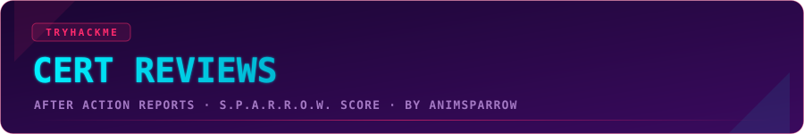

  

  
  

---

## What this is

After Action Reports on TryHackMe professional certifications. Not marketing copy, not a portal-style review. Each one covers what the exam actually tested, how it went, where it fell short, and an honest score, followed by two summary reviews once all 7 are done: one from the perspective of someone earning the certs, one from the perspective of someone hiring for them.

  

  Use code <code>KAROL20</code> on any <a href="https://tryhackme.com/certifications"><b>certification</b></a> or on <a href="https://tryhackme.com/certifications?view=bundles"><b>BUNDLES</b></a> for 20% off

## Methodology: S.P.A.R.R.O.W. Score

Every cert in this series is scored on the same 7-dimension scale, so the results stay comparable.

| Letter | Dimension | What it measures |
|:---:|---|---|
| **S** | Scope | Does the cert's actual coverage match what it advertises up front |
| **P** | Practicality | Do the scenarios reflect real work, or are they gamified filler |
| **A** | Access | Is the prep material (course/learning path) good enough to get you there |
| **R** | Reliability | Does the platform/exam environment hold up technically |
| **R** | Rigor | Is the grading consistent and fair relative to what was demonstrated |
| **O** | Outcome | How much this actually signals to an employer |
| **W** | Worth | Value for Money. Is the price fair for what you tangibly get, content, prep material, exam attempts, validity period, independent of whether it pays off career-wise (that's Outcome's job) |

**Weighting.** Practicality, Outcome and Worth matter most to someone deciding if a cert is worth their time and money, so they carry the heaviest weight. Scope and Rigor come next: once you commit to an exam, you want it to test what it claims and grade you fairly. Access and Reliability carry the lowest weight: useful context, but the least decisive factor in whether the cert itself is worth it.

**Weights used across this series: High x6, Medium x2, Low x1.**

| Tier | Weight | Dimensions |
|---|:---:|---|
| High | x6 | Practicality, Outcome, Worth |
| Medium | x2 | Scope, Rigor |
| Low | x1 | Access, Reliability |

Overall score = (sum of each dimension's score x its tier weight) / (sum of all tier weights), out of 10.

## All Reviews
> As of 07.08.2026, SAL2 completed the set — first TryHackMe user to hold every certification (confirmed with THM admin). 🥇
> 
| Cert | Date | Overall Score | Review |
|---|:---:|:---:|---|
| SEC0 - Pre Security | 06.03.2026 | **4.88/10** | [Full review](sec0-review/) |
| SEC1 - Cyber Security 101 | - | - | coming soon |
| SAL1 - Security Analyst L1 | - | - | coming soon |
| SAL2 - Security Analyst L2 | 07.08.2026 | **8.75/10** | [Full review](sal2-review/) |
| PT1 - Junior Penetration Tester | - | - | coming soon |
| WEB1 - Web Application Security | - | - | coming soon |
| AI1 - AI Security | - | - | coming soon |

## Summary Reviews

Once all 7 certs are reviewed:

- **The Employee's Take** - why do this at all, what it actually gave me day to day (coming soon)
- **The Recruiter's Take** - what these certs actually signal on a CV, and what they don't (coming soon)

---

  
  
  

