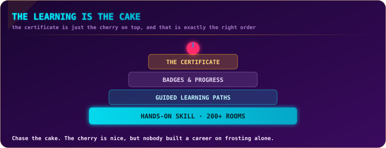
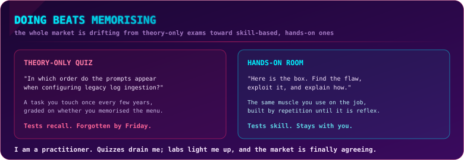
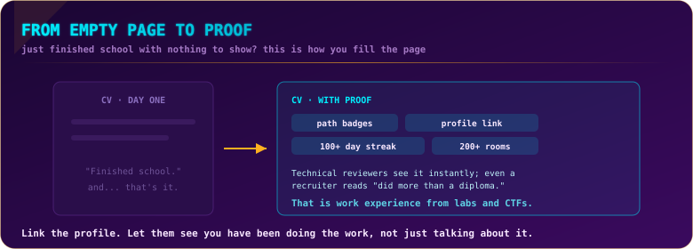
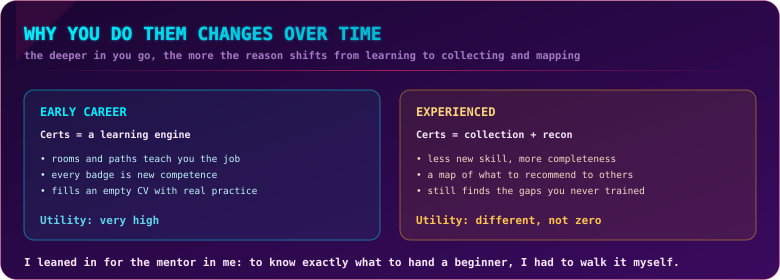
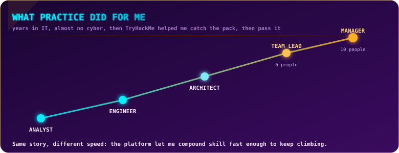
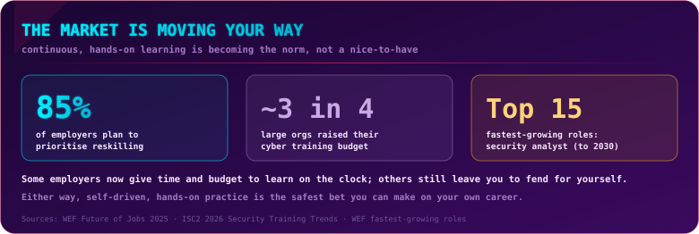

  

  
  
  
  

## What this is

The companion piece flipped the chair around to face the hiring side. This one puts me back in my own seat: the person who actually sat all seven exams and did the hundreds of rooms behind them. It is written for two people at once, the one trying to break into cyber, and the one already inside it looking to get sharper. And it is unapologetically about the part that matters most to me, which is not the certificate at all. It is the learning.

> [!NOTE]
> **TL;DR** The knowledge is the point; the certificate is the cherry on top. TryHackMe's real value is that it teaches you the job, step by step, in a way that sticks, and the badge at the end is a bonus, not the reason. Today these certs do not clear the ATS, but the more people earn them and talk about them, the sooner they climb onto the pedestal the theory-only certs are sitting on. I am a practitioner to the core, so I want that shift to happen. Here is why the platform is worth it whether you are on day one or year ten.

  

## The cake and the cherry

Somewhere along the way, certificates got mistaken for the goal. They are not. They are the frosting on a much bigger cake, and the cake is everything you actually learned getting there. When I look back at this whole series, the certs are the smallest part of what I gained. The real haul is the hundreds of hours of doing, the reflexes I built, the mental models that now fire automatically when I look at a network or a log or a web request.

That order matters, because it changes how you should spend your time. If you chase the certificate, you optimise for passing an exam and forget it a month later. If you chase the learning, the certificate falls out as a natural by-product, and the skill stays. Nobody ever built a career on frosting alone. Chase the cake.

## Doing beats memorising

  

I have a bias and I will own it: I am a practitioner. I love doing the thing. Quizzes drain me, and I have never understood the logic of an exam that asks which order the prompts appear in when you configure some legacy log source you touch once every few years in one specific product. Who carries that around in their head? You look it up in the two minutes it takes, the same way everyone does, and you get on with the actual work. Grading someone on menu recall tells you they can memorise a menu. It tells you nothing about whether they can defend anything.

Hands-on exams flip that. They put a real box in front of you and ask you to do the job, and you either can or you cannot. The skill you build that way is the same muscle you use on shift, grown by repetition until it becomes reflex. This is not just my taste, either; the whole market is drifting this direction. The World Economic Forum and CompTIA both describe a shift toward skill-based, hands-on, project-driven learning, because employers have worked out that recall does not equal capability. I want the practical certs to keep pushing the theory-only ones off their pedestal, and I think they eventually will.

## If your CV is empty, this is how you fill it

  

For anyone just starting, this is where TryHackMe earns its keep hardest. The early phase of a cyber career is brutal precisely because you have nothing to point at. You finished a course or a degree, and your CV says "finished school," and then it stops. Everyone applying next to you has the same page.

TryHackMe fixes that in a way that is genuinely enjoyable to do. The rooms are pleasant, the paths walk you through a topic step by step instead of dumping you in the deep end, and you get a badge of completion at the end of a bigger path. Better still, your profile quietly keeps score: a year-activity heatmap, a running room count, the streak. Now, be honest about who that speaks to. A recruiter may not know what "200 rooms" means, but a technical reviewer reads it instantly, and even a non-technical screener understands "did more than the diploma." Add the badges and the certificate, link the profile, and suddenly your empty page shows real, dated practice. That is work experience from labs and CTFs, and it is the difference between someone who says they want to do this and someone who visibly already does.

If it helps to hear it plainly: I do not have a degree, and this proof-of-practice is exactly what carried me. A visible body of work outruns a missing diploma more often than people starting out dare to believe.

## Why you do them changes over time

  

Here is the honest arc, because it is not the same story forever. Early on, every room and path and badge is new competence, and the utility is enormous. The further into the woods you go, though, the more the reason shifts. With years behind you, a cert stops being the thing that teaches you the job and starts becoming a bit of a badge collection, a completeness thing, a way to keep the set whole.

I leaned into it anyway, and deliberately, for a specific reason: the mentor in me. A big part of my work now is guiding people who are starting out, and to recommend the right entry and mid-level path with any authority, I had to walk every step of it myself. You cannot honestly tell a beginner "do this, skip that" if you have not done and skipped it yourself. So even at the badge-collector end of the curve, the value was not zero, it was different. And there is a quieter benefit too: even after years, a good path surfaces a corner you never actually trained, a gap you can now close on your own terms instead of discovering it live in production.

## What practice did for me

  

Let me be personal about this, because my path is the whole argument. I do not have a university degree. I am not a master, not even an engineer on paper. My formal title is *technik informatyk*, a vocational IT qualification, and that is it. Before IT I did a lot of unrelated things: I planted forests in Sweden, took inventory jobs in Germany, and worked at an ad agency where I somehow ended up voicing two radio spots. I came into IT ten years ago through a helpdesk, moved into Identity and Access Management within about two years, and from there into cyber, arriving with plenty of IT under my belt but very little security knowledge and a gap to close fast.

TryHackMe is a large part of how I closed it. It let me catch up to colleagues who had been in security far longer, and then, over time, move past them, not because I am special, but because the platform let me compound skill quickly and consistently, without waiting for anyone's permission.

The arc speaks for itself, and it forks the way real careers do. Analyst to engineer, and then the ladder split: a technical track that led to architect, and a leadership track that started when I took over a six-person team. Those two did not cancel each other out. During my time leading, I also stepped into management while staying technical, still an architect, and the team grew from six to ten under me. I am not claiming a certificate did any of that. I am saying the practice underneath the certificates did, the daily habit of doing the work in a safe place until it became reflex. No degree required, just reps, run at a high clock speed because I finally had a way to keep learning on my own terms.

## The market is moving your way

  

If you needed a reason beyond my enthusiasm, the numbers are on your side. The World Economic Forum's 2025 Future of Jobs report has 85% of employers planning to prioritise reskilling, and puts information security analyst among the fastest-growing roles through 2030. ISC2's 2026 training research shows roughly three in four large organisations increased their cybersecurity training budgets, most of them structuring it by role rather than one-size-fits-all. The direction of travel is unmistakable: continuous, hands-on learning is becoming the default expectation, not a bonus.

One honest caveat, because it matters for how you plan. Some employers are genuinely good at this now, they give you time on the clock and a budget to grow, and that is becoming more common. Others still hand you the job and leave you to fend for yourself. I am lucky to have a supportive company, but I also run at a very high pace while the energy is there, faster than most L&D programmes are built for, so I have always leaned on a few sources of my own. Whichever kind of employer you land with, self-driven, hands-on practice is the safest bet you can place on your own career, because it is the one part nobody can take away from you.

## What people are saying

I am not a lone voice here, and it is worth hearing the chorus, because it is remarkably consistent. Career-changers describe the platform as the thing that turned cybersecurity from abstract theory into something they could actually do; one bootcamp learner put it as the field no longer being just theory but a place you step into. Software engineers exploring a move into security use the SEC1 path as their on-ramp to foundational skills before specialising. Beginners run their first CTF and walk away hooked, describing failure and retry as the actual lesson. Across review sites the same words keep surfacing about the platform: hands-on, beginner-friendly, gamified, practical, a clear sense of progression.

The critical voices are worth hearing too, and they sharpen the point rather than blunt it. The consistent caution is that the platform alone will not hand you a job, and that "completed some rooms" on a CV is not enough on its own. That is fair, and it is the same thing I said from the recruiter's chair: the learning wins you the interview, it does not clear the filter by itself. Nobody serious claims TryHackMe is a magic ticket. What they claim, and what I will happily co-sign, is that it is one of the most effective and enjoyable ways to actually get good.

## How to use it, by stage

- **Total beginner:** work a whole path end to end rather than cherry-picking rooms. The step-by-step build is the point, and the completion badge plus your profile become your first real proof of practice.
- **Career-changer from another IT role:** use it to close the specific gap, the way I did. You already have transferable instincts; the platform lets you convert them into security-shaped skill fast.
- **Employed and levelling up:** treat it as a low-risk range. Test the techniques you would never trial in production, and let it surface the corners of the field you have never formally trained.
- **Mentor or lead:** walk the entry and mid-level paths yourself so your recommendations are earned, not guessed. Knowing exactly where a beginner will struggle is worth the time it costs you.
- **Everyone:** link your profile, and pair the streak with two or three specific write-ups. Proof of practice plus proof of thinking is what actually lands.

## Bottom line

The certificate is the cherry. The cake is the fact that you can now do things you could not do before, and that is the part that pays you back for the rest of your career. Right now these certs will not carry you past an automated CV filter, and I have never pretended otherwise. But recognition is a function of adoption, and adoption is climbing: every person who earns one, links their profile, and talks about it moves the whole category a step closer to the pedestal the theory-only certs are still standing on. I want that future, because I am a practitioner and I believe the industry is better when it rewards people who can actually do the work. Earn the certs if you like, I did, all seven. Just make sure you are there for the cake.

For the hiring side of this same story, what these certs signal to an employer and what they do not, see **The Recruiter's Take**.

## Sources

- World Economic Forum, *Future of Jobs Report 2025* — 85% of employers plan to prioritise reskilling; information security analyst among the fastest-growing roles to 2030: https://www.weforum.org/publications/the-future-of-jobs-report-2025/
- ISC2, *2026 Security Training Trends* — roughly three in four large organisations increased cybersecurity training budgets; role-specific structured training: https://www.isc2.org/Insights/2026/06/ISC2-2026-security-training-trends
- ISC2, *2025 Cybersecurity Workforce Study* — mindset shift toward upskilling existing staff; professional-development budget and dedicated learning time: https://www.isc2.org/Insights/2025/12/2025-ISC2-Cybersecurity-Workforce-Study
- CompTIA, *Workforce and Learning Trends 2026* — shift toward skill-based, hands-on, role-specific learning: https://www.comptia.org/en-us/resources/research/workforce-and-learning-trends-2026/
- TryHackMe on building a portfolio and learning by doing (rooms, paths, badges, profile activity): https://tryhackme.com/resources/blog/how-to-build-a-cybersecurity-portfolio-that-gets-you-hired
- Learner and career-changer accounts of the platform as hands-on and career-launching (DEV Community, Substack, review aggregators) — cross-referenced rather than quoted.

---

  

  
  
  

