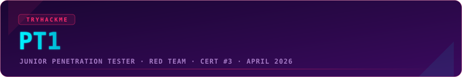
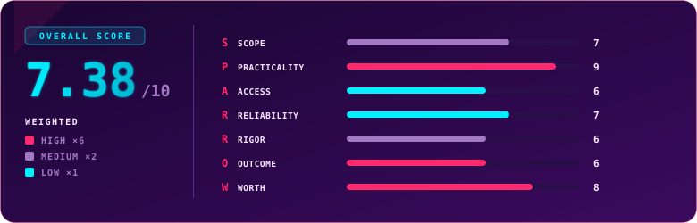

  

  
  
  
  

## Overview

> [!NOTE]
> **TL;DR** PT1 (Junior Penetration Tester) is TryHackMe's hands-on offensive certification: a full-stack engagement across web application, network, and Active Directory targets inside a 48-hour window, scored on flags plus a client-style report. This is the one that broke me. I am a blue teamer by trade, I took a red-team swing, and it drove me straight into a wall. It took two attempts, two roughly 20-hour days, a failed first run, and a human review that turned a 7-point fail into a pass, though I had to wait for it. It is also the only cert in my collection that never got its own celebratory post, because for a while there was nothing to celebrate. Funny thing is, the web section that beat me black and blue quietly became my guilty pleasure. Weighted score: **7.38 / 10**.

  

## Exam Parameters

| Parameter | Detail |
|---|---|
| Full name | Junior Penetration Tester (PT1) |
| Format | Hands-on penetration test plus a structured, client-style report |
| Sections | Three: Web Application (AppSec), Network (NetSec), and Active Directory |
| Scoring | Flags, severity and vulnerability IDs by exact match; the written report graded by AI with human cross-checks |
| Pass mark | 750 / 1000 |
| Exam window | 48 hours, at your own pace, and the timer does not pause once started |
| Environment | Provided AttackBox, or your own Kali over the supplied OpenVPN config |
| Retake | 1 free retake (flags and vulns re-randomize on the new attempt) |
| Price | €301, or roughly €256 for existing Premium/Max subscribers (15% off) |
| Bundle | WEB1 + PT1 for €450 (20% off each) |
| Learning included | 3 months of premium access to the Cyber Security 101 and Jr Penetration Tester paths |
| Positioning | Listed at $349 with training, against PenTest+ at $1,319, CEH at $650, PJPT and eJPT at $249 |

## Terrain

PT1 is a single 48-hour engagement split into three fronts, and the design goal is clear from the first hour: this is meant to feel like a real assessment, not a flag hunt.

The web application section is one web app with a set of findings that yield flags, though you will usually spot more issues than the ones that score. It leans hard into modern web flaws, logic abuse, and request manipulation, the kind of thing you live in Burp Suite for. The Active Directory section puts you against a domain-joined workstation and a domain controller, where enumeration is the whole game and the intended path runs through authentication and privilege weaknesses rather than a single clean exploit. The network section looks CTF-shaped on the surface, a couple of hosts to compromise, but it punishes anyone who grabs a root shell without being able to explain, in writing, exactly how they got it.

That written explanation is the twist that separates PT1 from a boot-to-root. Flags alone do not carry you. For each finding you file a structured report entry with an overview, scope, impact, a vulnerability class, a CVSS severity, the flag, a reproduction walkthrough, and remediation advice. The flags, severities and vuln IDs are graded by exact match; the prose is graded by AI, with humans in the loop. The environment is randomized per candidate from a vulnerability pool, so no two exams are identical and a retake hands you a fresh set. You can run it from the browser AttackBox or connect your own Kali over VPN, which for anyone with a tuned local setup is a genuine relief.

## Mission Debrief

I won my voucher in a Valentine's competition, which is a soft way to walk into a brawl. I am a blue teamer, but you do not turn down a free swing at the red side, so I prepared properly: I worked the entire recommended path, made sure I actually understood the techniques rather than just running them, and even put them to use live alongside industry friends on CTFs. I felt ready.

The first attempt was 20 hours, straight through, no sleep. The web section took me apart, I surfaced only about half of its flags, and even Active Directory, my old specialty from years back, did not fall the way I expected. I threw everything I had been taught at it, and a little more, and it was not enough. I failed at 628. What I walked away with, though, was the map: I now knew the shape of the exam, what it wanted, and exactly where I had come up short. So I studied past the "recommended" line and closed the gaps.

The second attempt is one I will remember for a long time. Network went down fast this time. Active Directory, no longer resisting, fell under the pressure, and I had maximum flags off both sections with my confidence up. Then came the web app, which is quietly my favourite kind of work. The target was a banking application that genuinely impressed me, full of race-condition-flavoured logic bugs that were a joy to pick apart in Burp, and on the second run even through raw curl. And then I stalled. I hunted for a flag for the better part of 20 hours and found nothing. I stepped away from the machine and told my wife, out loud, that I needed just one more flag to even have a shot at passing. I went back, and it clicked. A few fast clicks, a check, and there it was. I do not think I had been that happy since my wedding day. I did the maths in my head, knew it would be desperately close, told my wife I was out of fuel and terrified of losing by some stupid handful of points, and closed the exam an hour later at 743. Seven points short.

## Friction Points

> [!WARNING]
> **The 48-hour clock does not pause, and the difficulty does not care that the badge says "Junior."** Once you start, the timer runs whether you sleep or not, which is how I ended up pulling two 20-hour days. Plan real rest into the window instead of doing what I did. The network section also draws from a pool that can swing between trivial and brutal, so do not assume your run mirrors anyone else's. And treat the report as half the exam, not an afterthought you rush at hour 47, because that is exactly where points quietly slip away.

## Debrief Accounting

Here is the part that stung, and the part worth reading if you are on the edge of a pass. My flags were right and my techniques were sound; where I lost points was in the write-ups. The AI grader read my straight-to-the-point descriptions as too thin on detail, and it was partly fair and partly not. For the volume of correct flags I had, getting so little back on the descriptions felt off, so I used the option people forget exists: a support ticket asking for a human review. I laid out what I had found, where I had not found flags, and the extra weaknesses I had noticed along the way, and asked a person to look. The reviewer awarded 8 additional points on the very first question and stopped there, because that was already enough. Final score: 751, a pass by a single point. Did I want the whole report re-graded? No. I did not care about a bigger number. I cared about the small confirmation box that said the weeks of study and the two 20-hour days had not been for nothing.

Two things I want to be fair about. First, the reporting interface itself is excellent, a clean structured tool rather than a blank Word document, and it lets you focus on content over formatting. Second, on preparation: at the time I sat it, the exam was superb but plainly not scaled to its own learning path, and I had to go well beyond the recommendations to have a chance. I know seasoned people, folks who genuinely live off bug bounty, who stumbled on either the network or the web section. That feedback, from a lot of us, seems to have landed: the red team path has since been completely rebuilt, and having gone through the new version I can say it has real depth now. If I were starting today with none of yesterday's knowledge, it would take me far longer and might have discouraged me, which is a backhanded compliment to how much better it is.

## S.P.A.R.R.O.W. Score

| Letter | Dimension | Weight | Score | Reasoning |
|:---:|---|:---:|:---:|---|
| **S** | Scope | ×2 | 7 | It delivers full-stack web, network and AD testing plus real reporting, but the "Junior" name is a genuine misfit for a 20-hour grind in Burp and curl, so the label both undersells and misdescribes what you are walking into. |
| **P** | Practicality | ×6 | 9 | It breaks the flag-grab CTF mould with scoped, non-disruptive testing, pivoting, modern web logic bugs and a client-style report; this is close to a real engagement. |
| **A** | Access | ×1 | 6 | At the time, the recommended path fell well short of the exam and I had to study beyond it; the since-rebuilt red team path is far deeper and closes much of that gap. |
| **R** | Reliability | ×1 | 7 | Mostly stable across two long sittings and the own-Kali VPN helps, but at one point I had to reset every machine, for no reason I could see, before I could reach the target again. |
| **R** | Rigor | ×2 | 6 | Flags and severities are exact-match and fair, but the AI report grader penalized concise, correct write-ups hard enough to fail me by 7 points until a human review restored them. |
| **O** | Outcome | ×6 | 6 | Among TryHackMe's certs it carries real name recognition and maps to junior pentest roles, but OSCP still gates offensive hiring, so it is a strong supporting signal rather than a door-opener. |
| **W** | Worth | ×6 | 8 | For about €256 with the discount you get a genuinely realistic full-stack exam, pro reporting, path access and a free retake, undercutting PenTest+, CEH and OSCP dramatically; the free retake alone earned its keep for me. |

### Overall score: 7.38 / 10

| Tier | Weight | Scores | Weighted subtotal |
|---|:---:|---|:---:|
| High | ×6 | Practicality 9, Outcome 6, Worth 8 → sum 23 | 138 |
| Medium | ×2 | Scope 7, Rigor 6 → sum 13 | 26 |
| Low | ×1 | Access 6, Reliability 7 → sum 13 | 13 |

`(138 + 26 + 13) / 24 = 177 / 24 = 7.38`

> [!TIP]
> This number is a fight between a brilliant exam and a few rough edges. Practicality and Worth are both high and well-weighted, which is why the score holds up despite the bruises. What drags it are the softer marks: an AI report grader that can misread a lean, correct write-up, a learning path that historically undershot the exam, and a "Junior" label that does not match a 20-hour grind. The path has already been rebuilt and the grader is being tuned, so of everything in my collection this is the score most likely to climb on its own.

## Verdict

Take PT1 if you want to be tested like a real pentester rather than quizzed like a student, and go in understanding that Junior here means "early-career professional," not "beginner." The exam is one of the most faithful offensive assessments you can buy at this price, it covers ground that CySA-tier theory certs skip entirely, and it undercuts PenTest+, CEH and OSCP by a wide margin. Where I would set expectations honestly: the recommended path alone may not carry a true beginner, so budget serious box practice on top; the AI report grading means you must write your findings in real detail even when the flag feels obvious; and OSCP still owns the top of the offensive-hiring pile, so treat PT1 as a powerful proof of skill rather than a guaranteed key. For anyone who wants a real engagement in a box, especially paired with WEB1, it is a resounding recommendation, ideally caught on a discount. And on a personal note: when I see PT1 on a CV, I congratulate the person, shake their hand, and give a small bow of respect, because I know exactly what it costs to earn.

## Lessons Learned

- Enumerate like it is the whole job, because in the AD and network sections it very nearly is.
- Write every finding in full, even the obvious ones. Correct flags with thin descriptions is exactly how you lose by 7 points.
- The human-review ticket is real and worth using. If your flags are strong and the AI underscored your prose, make your case.
- Schedule sleep inside the 48 hours. My single best move on the second attempt was stepping away from the keyboard, and the flag I was stuck on appeared minutes after I did.
- Do not trust the "Junior" label to set your prep. Practice past the recommended path until every section feels routine.

## Certificate

  

  

### My Result

| | |
|---|---|
| Score | 751 / 1000 (pass mark 750) |
| Attempt 1 | 28 March 2026 — Fail, 628 |
| Attempt 2 | 5 April 2026 — Pass, 743 raised to 751 after human report review |
| Time used | Two sittings of roughly 20 hours each |
| Overall feel | My nemesis. The one that earned every point the hard way. |

---

  

  Use code <code>KAROL20</code> on <a href="https://tryhackme.com/certification/junior-penetration-tester"><b>PT1</b></a> or <a href="https://tryhackme.com/certifications?view=bundles"><b>BUNDLES</b></a> for 20% off

---

  

  
  
  

