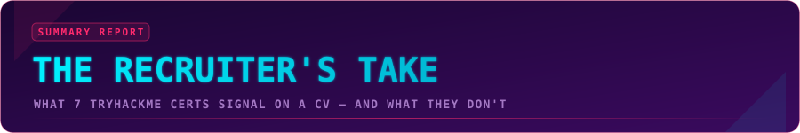
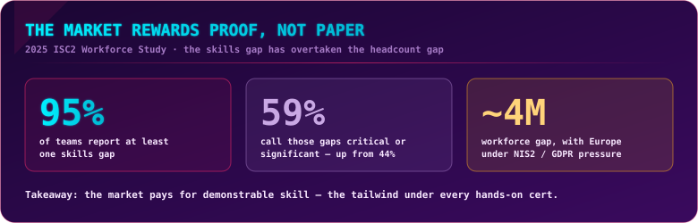
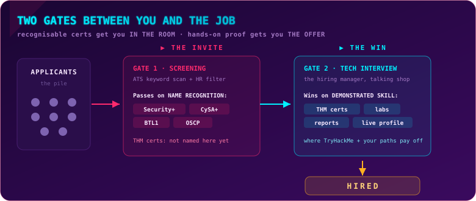
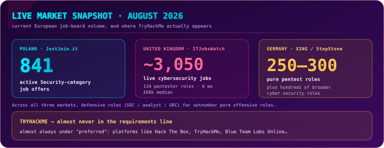
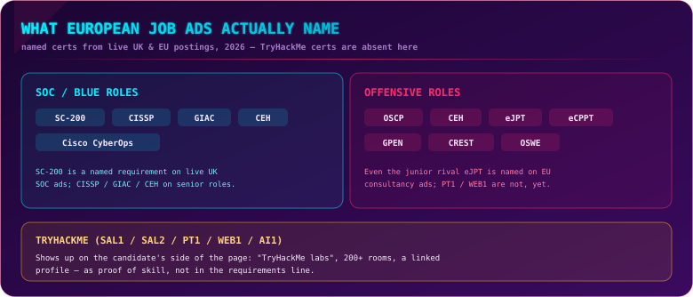
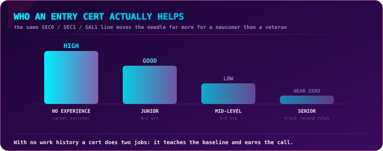
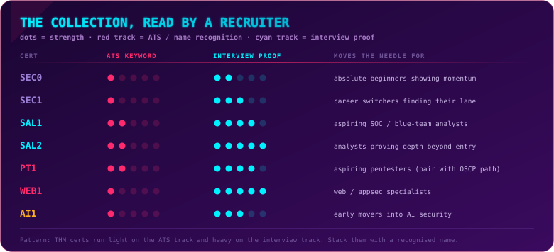
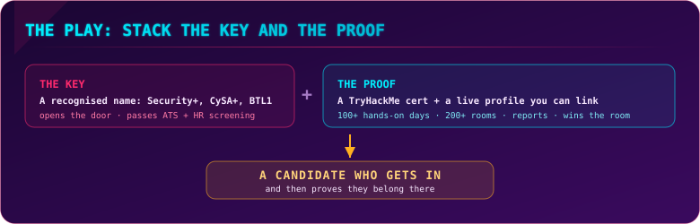

  

  
  
  
  

## What this is

I have spent this series scoring seven TryHackMe certifications from the candidate's chair. This companion piece flips the chair around. It is the honest hiring-side read: what these certs actually signal on a CV in the European market of 2026, what they do not, and how to make them work for you rather than sit dead on the page. No S.P.A.R.R.O.W. score here; this is about the market, not the exam.

> [!NOTE]
> **TL;DR** Recognised names like Security+ and CySA+ get your CV through the door. TryHackMe certs, your learning paths, and a live profile full of hands-on work are what win the interview once you are in the room. The two are not rivals, they are a stack. Bring the key and the proof. Recognition of TryHackMe certs is growing, with Accenture and Salesforce backing SAL1, but as of August 2026 they remain primarily a tool for winning the interview rather than clearing the ATS filter.

## The market has moved

  

The most important shift for anyone weighing these certs is not about TryHackMe at all. It is that the market has stopped counting heads and started counting skills. In the 2025 ISC2 Cybersecurity Workforce Study, 95% of teams reported at least one skills gap and 59% called those gaps critical or significant, up from 44% a year earlier. ISC2 was so struck by this that it stopped publishing its long-running headcount-gap number, because respondents kept telling them specific skills mattered more than raw bodies. Europe feels this acutely: a workforce gap in the millions, sharpened by NIS2 and GDPR obligations that demand real capability, not box-ticking.

That is the tailwind under every hands-on certificate. When employers are hunting for proven skill, a credential that makes you actually do the work is aimed exactly where the market is looking.

## Two gates between you and the job

  

Every hire passes through two gates, and they reward completely different things.

**Gate 1 is the screening gate.** An applicant-tracking system scans for keywords, then a recruiter skims for names they recognise. This is where the established certs win. In UK and European entry-level adverts, CompTIA Security+ is the one most often asked for by name, and it is what gets a career-changer's CV past the first filter. CySA+, BTL1 and, on the offensive side, OSCP do the same job. TryHackMe's professional certs, for now, mostly do not appear here as named requirements. What does appear is the platform itself, listed as a nice-to-have: adverts that say "participation in CTFs or platforms like Hack The Box, TryHackMe" and treat that activity as evidence of technical proficiency.

**Gate 2 is the interview gate.** Now you are in a room with a hiring manager who wants to talk shop. This is where recognition stops mattering and demonstrated skill takes over. The advice every serious resume guide gives is the same: what you can *do* outshines what is on the page once you make it to an interview, and the way you prove it is by walking through your labs out loud, what you built, what you looked for, what you would do next. This is exactly the ground TryHackMe certs and their learning paths prepare you for. A PT1 or WEB1 report, a SAL1 investigation, an AI1 assessment; these are interview gold.

So the line to hold in your head is simple. **Recognised certs get you the invite. TryHackMe certs and your paths win the interview.**

## What the job boards actually name

> [!IMPORTANT]
> **Snapshot date:** All live job-board figures and named-requirement examples were captured on **15–16 August 2026**. Individual postings expire quickly; numbers and specific ads may no longer be current after that date.

Here is the live scale of the market as of mid-August 2026, and where TryHackMe actually shows up.

  

The raw volume tells a clear story. On **JustJoin.it**, Poland's main tech board, the Security category is carrying 841 active offers. In the **UK**, ITJobsWatch tracks roughly 3,050 live cybersecurity jobs, of which 134 are permanent Penetration Tester roles advertised over the previous six months, at a median near £60,000. In **Germany**, XING and StepStone list hundreds of cyber security roles, with pure penetration-testing positions in the region of 250 to 300. Across all three markets the same imbalance holds: defensive roles (SOC analyst, security analyst and GRC) comfortably outnumber pure offensive ones. And across all of them, TryHackMe almost never appears as a named requirement. Where it shows up, it is under "preferred," in the now-familiar phrasing "experience with platforms such as Hack The Box, TryHackMe, Blue Team Labs Online."

Three markets, three slightly different accents:

- **UK** — the strongest presence of Security+ paired with CREST and OSCP on the offensive side, and the market where TryHackMe and Hack The Box turn up most often as *preferred* experience.
- **Poland** — heavy emphasis on ISO 27001, NIS2 and DORA alongside practical skills; CompTIA and OSCP appear, but TryHackMe is almost never in the requirements.
- **Germany** — strong demand for OSCP, GPEN and CREST-style credentials, with NIS2 pressure visibly driving defensive hiring.

Zoom in on the named credentials themselves and the pattern sharpens further.

  

I did not want to hand-wave this, so I went looking at what live European postings actually ask for. The picture is consistent and worth being honest about.

On the **blue-team side**, real UK and EU SOC listings name Microsoft's SC-200 (it appears as a mandatory requirement on multiple Experis and similar recruiter postings), and on more senior roles they list CISSP, the GIAC family (GCIA, GCIH, GNFA, GCTI), CEH, Cisco CyberOps and "Certified SOC Analyst." On the **offensive side**, pentest and red-team ads across Europe name OSCP first, then CEH, GPEN, CREST, OSWE, and, tellingly, the junior eLearnSecurity certs eJPT and eCPPT. That last detail matters: even a direct "junior" competitor to PT1 already shows up as a named, advantageous cert on European consultancy job ads, and PT1 and WEB1 do not, yet.

TryHackMe is not absent from these pages, though. It appears on the **other side of the paper**, the candidate's side. Real applicant profiles list things like "TryHackMe labs," "triaged 200+ SIEM alerts," and a linked profile as evidence of hands-on capability. That is the whole thesis of this piece in one observation: on a job posting, the recognised certs sit in the requirements column; TryHackMe sits in the proof-of-skill column. Different jobs, both useful.

One more piece of grounding, because money is context: entry SOC-analyst roles in the UK are commonly advertised somewhere around £25,000 to £41,000, based on the live postings I looked at. Pay climbs with seniority and swings widely by country, so I will not pretend a single European range means much. The point that actually matters here is simpler, and it holds at every level: none of these roles gate on a TryHackMe cert today. They gate on the recognised names and, increasingly, on what you can show you have done.

## Who an entry cert actually helps

  

The same certificate is worth wildly different amounts depending on who is holding it. For someone with no security work history, an entry cert does two jobs at once: it teaches the baseline, and it gives a recruiter a concrete reason to call. Labs, CTFs and a cert are the closest thing to experience that a career-changer can show, and hiring guidance is explicit that they routinely substitute for the missing job title. For a junior with a year or two behind them, the cert still helps, but their actual work starts doing the talking. By mid-level it is near-decoration, and for a senior it barely registers, because a track record and advanced credentials have taken over.

The practical takeaway maps straight onto the collection. SEC0 and SEC1 carry real weight for a total beginner signalling momentum and almost none for anyone employed. SAL1, SAL2, PT1, WEB1 and AI1 climb from there because they prove progressively deeper capability. If you are early, these certs are a genuine lever. If you are established, they are a way to prove you have moved into a new lane, not a way to prove you belong in the field.

## Your profile is now part of your CV

This is the piece the old certs cannot match, and it is where TryHackMe quietly shines. A modern cybersecurity CV is not just a page, it is a page with links, and the strongest link you can add is a live profile that shows your work. Resume guidance in 2026 is blunt about it: a portfolio of documented work is worth more than a polished resume on its own, so include a link to your GitHub, your blog, or your TryHackMe profile and let the hiring manager see what you have actually done.

A public profile showing 100-plus days of hands-on activity, 200-plus rooms cleared, and a wall of badges is a different kind of evidence from a single line that reads "CompTIA Security+." One says *I passed a test*. The other says *I show up and do this constantly*. In a field drowning in people who talk about cybersecurity, visible, dated, verifiable practice is the cleanest way to separate someone who does the work from someone who only says they want to.

And employers are quietly inviting exactly this. Two live examples from August 2026 make the point:

- **Huntress, SOC Analyst (UK).** Under preferred qualifications the ad asks for demonstrated experience on platforms such as HackTheBox, TryHackMe and Blue Team Labs Online. Not required, but explicitly welcomed as evidence.
- **A UK financial-services Cyber Threat Analyst (penetration testing) role.** Its "desirable" list names demonstrated activity on TryHackMe, HackTheBox, or OSCP-related and red-team training platforms, right alongside the formal certs.

Neither posting makes TryHackMe a gate, and that is the point. It sits in the "we would love to see this" column, which is precisely the column a linked, curated profile fills.

> [!WARNING]
> **Volume alone is noise.** "Completed 200 TryHackMe rooms" on its own will not move a recruiter, and hiring managers say so. The streak is the backdrop; the foreground has to be specific. Pair the profile link with two or three concrete write-ups or exam reports, PT1 or WEB1 findings, a SAL1 investigation, so the activity resolves into demonstrated skill rather than a grind counter. Proof of practice plus proof of thinking is the combination that lands.

## How to actually present them

Because the whole value sits at Gate 2, presentation is not a cosmetic afterthought here, it is most of the return on the cert. A few things that consistently help:

- **Put the cert in a Certifications line and the skill in your Experience.** A recruiter scanning for "SAL1" will not find it useful, but a bullet that reads like real work will: what you investigated, which tools, what you concluded. Describe a TryHackMe engagement the way you would describe a job task.
- **Lead with the recognised name, back it with the hands-on one.** "CompTIA Security+ · TryHackMe SAL1 · home-lab SOC" as a headline does both jobs at once: it clears the keyword filter and signals momentum.
- **Link the profile, then curate what it points at.** A public profile is only an asset if the first thing a manager sees is coherent. Pin or reference the rooms and reports that match the role you want, not the random spread.
- **Turn the exam into an interview story.** The reason these certs win Gate 2 is that they give you genuine "I did this" material. Have two or three ready in a Situation-Task-Action-Result shape, and be ready to talk through your reasoning, not just the outcome.
- **Match the cert to the lane, not the ego.** A SOC role wants SAL1 or SAL2 and your triage write-ups on top; a web role wants WEB1 and a couple of findings. Leading with the cert that fits the job beats leading with your highest-scored one.

None of this is unique to TryHackMe, it is simply how hands-on evidence is packaged so that a human, not a filter, gives it weight. The certs that carry name recognition do some of this work for you; TryHackMe certs need you to do it, and reward you well when you do.

## The collection, read by a recruiter

  

Read across any row and the same shape appears: light on the ATS track, heavy on the interview track. That is the signature of the whole collection. None of these certs is the name that gets scanned and matched by hiring software yet, and all of them are strong evidence once a human is actually assessing you. The differences between them are about *who* they help and *which lane* they point at, not about whether they clear a keyword filter.

Two of them are worth watching for a different reason: SAL2 (advanced SOC) and AI1 (AI security) are starting to fill gaps the traditional certs do not yet cover, and in the fast-growing AI-security lane especially, AI1 is one of the only hands-on credentials that exists at all, so scarcity works in its favour.

## The play: stack the key and the proof

  

The mistake is treating this as a choice. It is not TryHackMe *versus* CompTIA, it is TryHackMe *and* a recognised name. Get the credential that opens the door, then bring the credential and the profile that prove you belong once it is open. Concretely:

- **Blue team / SOC:** SAL1 or SAL2 alongside Security+ or CySA+, with your investigations linked.
- **Offensive:** PT1 and WEB1 as your proof pieces while you work toward the name recruiters still gate on, OSCP, with your reports and profile carrying the interview.
- **AI security:** AI1 as an early flag in the fastest-growing lane, where almost nobody has a hands-on credential yet, so the scarcity itself is signal.

## Bottom line

TryHackMe certs are not yet the words a machine scans your CV for, and pretending otherwise sets people up for disappointment. What they are is the most efficient way to build, and then *prove*, the skill that wins the room, in a market that has openly decided skill is what it is short of. Recognition is climbing, the Accenture and Salesforce backing behind SAL1 is exactly the kind of credibility that moves a cert from "interesting" to "known", but as of August 2026 these remain a tool for winning the interview, not for clearing the ATS filter. Stack them under a recognised name and behind a living profile, and you stop being a stack of paper and start being a candidate a hiring manager can already picture doing the job.

For the other side of this story, how these certs felt to earn and what they gave me day to day, see **The Employee's Take**.

## Sources

Market and hiring evidence behind this piece. Job-board links are live postings captured in mid-August 2026 and may expire.

**Market direction**
- ISC2, *2025 Cybersecurity Workforce Study* — skills gap overtaking headcount gap, 95% report a gap, 59% critical/significant (up from 44%), headcount-gap figure withdrawn: https://www.isc2.org/Insights/2025/12/2025-ISC2-Cybersecurity-Workforce-Study
- Security Info Watch summary of the same study: https://www.securityinfowatch.com/cybersecurity/article/55338497/cybersecurity-skills-gaps-now-outpace-headcount-shortages-isc2-workforce-study-finds
- Digital4Business, *The Cybersecurity Skills Crisis: Europe's 4 Million Gap* (NIS2 / GDPR pressure): https://digital4business.eu/cybersecurity-skills-crisis-europe/

**Live market figures (mid-August 2026)**
- JustJoin.it — Security category, 841 active offers (Poland): https://justjoin.it/job-offers/all-locations/security
- ITJobsWatch — Penetration Tester permanent demand and median salary (~£60k), 6 months to 16 Aug 2026: https://www.itjobswatch.co.uk/jobs/uk/penetration%20tester.do

**Live job ads citing TryHackMe / HackTheBox as preferred**
- Huntress, SOC Analyst (UK, August 2026) — preferred: demonstrated experience on platforms such as HackTheBox, TryHackMe, Blue Team Labs Online

**What EU/UK job ads actually name**
- Multiple Experis / recruiter SOC Analyst postings list Microsoft SC-200 as a mandatory or strongly preferred requirement (live examples confirmed mid-August 2026).
- Offensive roles commonly name OSCP, CEH, GPEN, CREST, eJPT, eCPPT.

---

  

  
  
  

