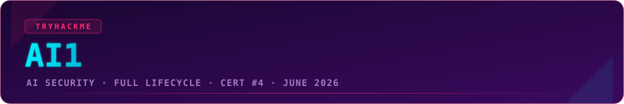
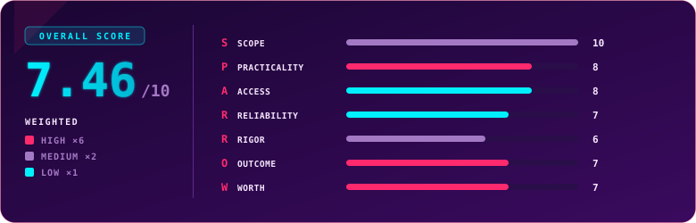

  

  
  
  
  

## Overview

> [!NOTE]
> **TL;DR** AI1 (AI Security) is TryHackMe's certification for attacking and defending real AI systems, spread across four sections and thirteen hands-on scenarios on live chatbots, model artefacts and RAG systems. I came in expecting a pure model-breaking exam and got something much wider: it tests the whole AI security lifecycle, offence, defence, risk assessment and reporting. I passed first time in about three and a quarter hours, holding several other AI fundamentals certs already, and this is the one that carries by far the most practical weight. It is broad, it is more grown-up than the vendor mini-courses, and it is an early but serious signal in the fastest-moving corner of security. Weighted score: **7.46 / 10**.

  

## Exam Parameters

| Parameter | Detail |
|---|---|
| Full name | AI Security (AI1) |
| Format | Browser-based, non-proctored; 4 sections across 13 hands-on scenarios on static sites and live AI chatbots |
| Sections | Threat Modelling, Prompt Injection & Jailbreaking, AI Supply Chain Security, Data Poisoning |
| Grading | Technical tasks auto-graded with immediate results; written mitigation plans and threat reports AI-assisted, returned within 24 to 48 hours |
| Pass mark | 70% |
| Exam window | 48 hours, but delivered as smaller, roughly hour-long timed pieces rather than one continuous block |
| Expected time | 6 to 8 hours of actual work |
| Validity | 3 years from passing |
| Retake | 1 free retake included |
| Price | $399, or about $339 with the 15% discount for active Premium subscribers |
| Framework | Mapped to the industry-standard AI security framework, no local install required |

## Terrain

AI1 is not the exam I braced for. I expected the "break the model, live" energy the marketing leans on, and that part is here in full, but it is one quarter of a much wider net. The four sections walk the entire lifecycle: modelling threats across an AI system's architecture, attacking and jailbreaking guarded assistants, triaging tampered model artefacts in the supply chain, and both crafting and defending against RAG-based poisoning. Thirteen scenarios sit under those four headings, some on static analysis sites, some against live chatbots you actually talk your way past.

The important thing to understand going in is that AI1 tests how you think, not just how you exploit. The offensive scenarios, the part I most enjoyed, mostly went smoothly for me. Where it stretched me was the risk-assessment and reporting side: scoring threats, prioritising them, writing mitigation plans that a non-technical stakeholder could act on. That is the half most people underestimate, because AI security is not only about popping prompts, it is about communicating risk to people who do not speak LLM. The exam clearly wants you to prove you can protect and assess, not just attack, and that is what makes it feel more complete than any AI course I had touched before.

One structural quirk worth flagging: unlike PT1 or WEB1, where 48 hours means 48 continuous hours for the whole engagement, AI1 chops the time into smaller pieces, roughly an hour per chunk. It changes the rhythm entirely, more sprint-and-reset than marathon.

## Mission Debrief

I earned my voucher the fun way, at the official AI Odyssey live CTF, where our team finished sixth. By the time I sat the exam the subject was familiar ground, so, being me, I decided to add my own difficulty modifier: I took the entire thing while walking on a treadmill at 4 km/h. By the time I hit submit I had covered 14 kilometres. Productivity, unlocked.

Preparation was quick, honestly too quick to recommend copying. I had speedrun the AI1 path at release, finishing it in under eight hours, because the material was already in my wheelhouse, and I still rate the path as good preparation for the exam. With hindsight I would tell a newcomer to spend more time specifically on the risk-assessment content, and to sharpen the offensive side on live AI Odyssey challenges, which are the closest thing to the model-breaking the exam throws at you. I went in least prepared for the risk-scoring rooms and ended up solving a lot of them on pure reasoning, which turned out to be enough, while the "convince the model" scenarios were where I felt most at home.

## Friction Points

> [!WARNING]
> **In a couple of scenarios the interface hid entire question panels the UI never signposted.** In one task I only ever engaged with the challenge itself; I had no idea there was also a question section tucked toward the left of the dashboard until I compared notes with a fellow candidate afterwards and was surprised she had answered questions I never saw. I think it happened to me twice. Nothing about the layout suggested there was more to find, so as you work each scenario, deliberately sweep the whole interface for panels, tabs or sidebars before you consider a room finished.

## Debrief Accounting

Grading is a mixed picture, and honesty matters here. The technical tasks grade automatically and instantly, which is exactly right. The written components, mitigation plans and threat reports, go through AI-assisted grading, and in the exam's first weeks that grader had a real bug. Two sections, Indirect Prompt Injection and the guardrailed variant, were under-scoring people, and I was handed exactly 27% in both when my work merited more. Because I had already passed, the system never engaged an administrator on my behalf, so my final number stayed as it was. I know two other candidates who hit the same fault and, after a human review, were corrected, in some cases from 27% all the way to around 80%, which was pass-determining for them. It was an early-days problem and I have not heard of it recurring since, but it is the honest reason I believe my real result should sit higher than it does. It is also worth noting AI1 is the only exam in my collection scored as a straight percentage rather than points; a clean 70% is the bar, and I cleared it at 72%.

On value against effort, this is the most practical AI security assessment I have taken, and I say that holding five different AI fundamentals certs from various vendors. Those are mostly quizzes; this one makes you do the work. The trade-off is that it demands genuinely broad knowledge, analysing, assessing, securing and attacking, which will not be approachable for everyone, and that breadth is exactly the point.

## S.P.A.R.R.O.W. Score

| Letter | Dimension | Weight | Score | Reasoning |
|:---:|---|:---:|:---:|---|
| **S** | Scope | ×2 | 10 | It covers the entire AI security lifecycle end to end, threat modelling, offensive prompt attacks, supply chain, data poisoning, risk assessment and reporting, with nothing meaningful left out. |
| **P** | Practicality | ×6 | 8 | Hands-on model-breaking plus real risk assessment and reporting make it the most practical AI security exam I have taken, though some risk rooms lean conceptual. |
| **A** | Access | ×1 | 8 | The AI1 path prepares you well, but I would add extra time on risk assessment and practise the offensive side on live AI Odyssey challenges to be safe. |
| **R** | Reliability | ×1 | 7 | The lab environment held up, but in a couple of tasks the UI hid entire question panels I only learned about afterwards, which is a real usability trap. |
| **R** | Rigor | ×2 | 6 | Technical tasks grade objectively and instantly, but an early AI-grading bug badly under-scored two injection sections; it is fixed and correctable via human review, yet it dented consistency at launch. |
| **O** | Outcome | ×6 | 7 | AI security is the fastest-growing specialism with demand outstripping supply, and this is one of the first genuinely hands-on certs in it, framework-mapped and far more substantial than vendor mini-courses; scarcity of both the skill and any comparable credential gives it a stronger forward signal than crowded offensive certs, held short of the top only because day-one recognition is still young. |
| **W** | Worth | ×6 | 7 | At $399, about $339 with the discount, it is TryHackMe's priciest cert, but it buys the broadest, most practical AI security assessment available and easily outclasses the cheap vendor courses, so the value holds for the serious. |

### Overall score: 7.46 / 10

| Tier | Weight | Scores | Weighted subtotal |
|---|:---:|---|:---:|
| High | ×6 | Practicality 8, Outcome 7, Worth 7 → sum 22 | 132 |
| Medium | ×2 | Scope 10, Rigor 6 → sum 16 | 32 |
| Low | ×1 | Access 8, Reliability 7 → sum 15 | 15 |

`(132 + 32 + 15) / 24 = 179 / 24 = 7.46`

> [!TIP]
> This is a strong, important exam with launch-phase fingerprints still on it. Scope is a perfect 10 and Practicality an 8, which is the real story: no other AI credential I hold makes you actually do this much, across this wide a range. What holds the number down is a premium price, a since-fixed grading bug, and a UI that hides things, none of which touch the quality of the assessment itself. In the fastest-moving field in security, this is the score most likely to age upward as the rough edges get sanded off and recognition catches up.

## Verdict

Take AI1 if you want to prove you genuinely understand modern AI systems, not just narrate them. Plenty of people talk about AI and pass as experts without knowing what actually happens inside a model, which components do what, or the risk each one carries; this exam separates those groups cleanly. Of everything in my collection it is closest in spirit to SAL2, because clearing it well demands a broad, almost "complete" picture rather than one deep trick. Set two expectations: it is genuinely wide, so a pure red-teamer who only wants to jailbreak chatbots will be surprised by how much assessment and reporting it asks for, and at $399, around $339 with the discount, it is the priciest cert here, so come when you are ready to use the breadth. For anyone serious about the fastest-growing specialism in security, this is a solid, forward-looking credential that I expect to earn real respect.

## Lessons Learned

- Sweep the whole interface on every scenario. Hidden question panels cost me points I never knew were on the table.
- Do not underestimate the risk-assessment half. The offence is the fun part, but the scoring, prioritising and reporting is where the exam is really won.
- Practise offence on live targets. AI Odyssey challenges mirror the model-breaking far better than reading ever will.
- If you pass but a section looks wrongly low, know that a human review exists. It will not trigger on its own once you have passed, so raise it yourself if it matters.
- Bring breadth, not one trick. This exam rewards the complete picture of how models work, break and get defended.

## Certificate

  

  

### My Result

| | |
|---|---|
| Score | 72% (70% required to pass) |
| Scoring | The only cert in my collection graded as a percentage rather than points |
| Time used | 3h 15m 26s |
| Attempt | 1 (passed first try) |
| Date | 25 June 2026 |
| Note | Two sections were under-scored by a since-fixed grading bug, so my true result likely sits higher |
| Overall feel | Broader than expected, and the most practical AI cert I hold |

---

  

  Use code <code>KAROL20</code> on <a href="https://tryhackme.com/certification/ai-security"><b>AI1</b></a> or <a href="https://tryhackme.com/certifications?view=bundles"><b>BUNDLES</b></a> for 20% off

---

  

  
  
  

