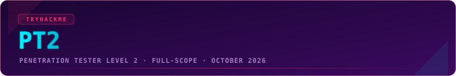
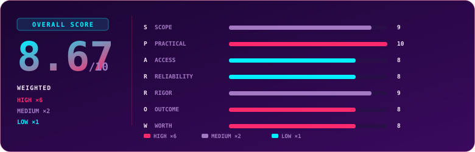

  

  
  
  
  

## Overview

> [!NOTE]
> **TL;DR** - PT2 is the most honest hard exam TryHackMe has shipped. One company's network, attacked from the outside over VPN with no credentials, spanning two worlds most certs keep apart: modern app and cloud infrastructure on one side, a full Active Directory forest on the other. The machines feed each other, so you are not solving ten puzzles, you are compromising one org. I finished with 10 of 11 flags and 40 hours of exam time unused, and I closed it on purpose rather than grind the last host. Hard enough to respect, fair enough that a prepared tester finishes early, and clear enough that you always know whether a miss was a skill gap or a wrong guess. Weighted **8.67 / 10**.

  

> As of **September 30, 2026**, completing PT2 made me the first and only person to hold every TryHackMe certificate #Again :D That framing is a big part of why this one mattered.

## Exam Parameters

| Item | Detail |
|---|---|
| Full name | Penetration Tester Level 2 (PT2) |
| Position in path | Advanced offensive tier, after PT1 and WEB1 |
| Format | Hands-on practical, black-box, with a mandatory written report |
| Structure | 10 machines across two independent sections that run in the same window. The two sections compete for your time at once |
| Attack surface | Web, AI/LLM, containers, cloud, and Active Directory |
| Start point | External, over VPN, zero credentials |
| Time | 72-hour window for the whole exam |
| Pass mark | 740 / 1000 |
| Grading split | Flag capture 70% · attack description 20% · remediation 10%. The report is 30% of the total mark, graded finding by finding |
| Retake | One free retake included |
| Validity | 3-year credential |
| Price | ~EUR 645 standard. Premium subscribers get roughly 15-25% off, MAX subscribers up to 40% off one cert |

## Terrain

PT2 is a single social-media company's network, and you attack it the way a real external tester would: from the outside, over a VPN, starting as an anonymous attacker with nothing. What makes it stand out is that it covers two worlds most certs keep separate. One side is modern application and cloud infrastructure. The other is a full Active Directory forest. Loot from one world does not open the other, so do not burn hours trying to bridge them.

The thing that defines the terrain is the chaining. You reach later hosts through earlier ones. Some targets are network-isolated and only answer from an internal foothold, so if you do not land host X, hosts Y and Z simply are not reachable. This is not a set of islands. It is one network, and your job is to move through it.

The Modern Infrastructure side spans a mix of contemporary attack surfaces: web, some AI-flavored targets, containerization, privilege escalation, and a cloud-style component. I'll stay deliberately light on the cloud piece so I don't hand anyone the map. It's the kind of terrain where the individual topics feel familiar, but stitching them into one working chain is the actual test.

The AD side is a proper modern-forest chain. It starts from something small and overlooked, moves through certificate services and Kerberos delegation, and eventually walks a trust relationship all the way up to forest root and beyond. I won't spell out the individual moves, that's the fun part, but if terms like relay, delegation, and cross-forest trust get you excited, this is your playground.

Who it lands differently for: if you have PT1 or equivalent and solid web, cloud, and AD fundamentals, this feels like a real engagement and moves at a good pace. If those fundamentals are shaky, PT2 will find the gaps. It is a better place to prove skills than to learn them.

## Mission Debrief

I went in prepared and treated every foothold as a vantage point, not a finish line. The moment I landed on a host, the first job was never privilege escalation. It was looking around from the new position: what can this box see that my attack box could not? Half of PT2's difficulty drops away once that becomes a reflex, because each compromise redraws the map and points you at the next target.

The second habit that paid off was reading the source. The modern-infra side hands you code more than once, and the intended path is usually sitting in plain sight for anyone who reads instead of fuzzes. The people who struggle here are the ones reaching for a scanner when the answer is a function definition.

I finished with 10 of 11 flags and 40 hours left in the window, and I stopped there on purpose. The last host was conceptually solved: I had its user context and had documented the intended privilege-escalation primitive cleanly. Finishing it meant defeating an endpoint defence under time I chose not to spend, and the outcome was not in doubt. Knowing when a box is solved in principle and not worth the extra hours is a real skill, and I would make the same call again.

> The reframe that carried the exam: a foothold is infrastructure, not a trophy. You take a host to see and reach what it can see and reach, not just for its two flags.

## Friction Points

> [!WARNING]
> Most of the friction is structural or cosmetic, not fatal. Nothing here broke the exam, but a few things are worth knowing going in so you do not lose time for the wrong reasons.

- **The chain is also the main risk.** The flip side of good chaining is dependency. Miss a pivot and a whole branch of the network goes dark. If you tunnel-vision on one host, PT2 can hide three flags behind one you skipped. I count that as a feature, it is how real networks fail, but enumeration discipline is not optional. Go breadth-first and map what each foothold can reach before you dig for root.
- **The report UI is misleading.** The reporting interface implies screenshots are expected and attachable, but there is no control to actually add them. I spent real attention looking for an upload button that the copy promised and the form never delivered. I reported it to TryHackMe. My read is an unfinished piece of the creator's vision rather than a trap, but as it stands it is a genuine point of confusion. Write your descriptions to stand on their own without images.
- **Two sections, one clock.** The two halves run in the same window and compete for your time. That is realistic, but if you sink the first day into one side you can leave yourself short on the other. Time-box each side early.
- **A couple of transient "exam not found" blips.** Across roughly twenty-odd hours of work, I saw an "exam not found" message maybe twice. Both times it cleared on its own, and my strong read is that it was tied to a session refresh on my end rather than anything wrong with the exam itself. For about 99.9% of the time the platform ran flawlessly, machines were stable and deploys were quick. Worth knowing only so you do not panic if you see it: refresh, re-auth, and carry on.

None of it was exam-breaking. The targets behaved consistently and deploy times were sensible, which is the part that matters most.

## Debrief Accounting

Grading is demanding and transparent, which is a big reason I trust the score I am giving. Flag capture is 70% of each finding, the attack description 20%, and remediation 10%, with the report making up 30% of the total. Because the file holding each flag is named in advance, flag-hunting stops being a lottery. In PT1 you would land a shell, fire a payload, and hope the output held the flag. In PT2 you often already see the file and the whole problem collapses to "get enough access to read it." It also means the flag's weight stops feeling punishing, because you are graded on access, not luck.

The partial credit is real and well calibrated. On the one host I did not fully own, a clean description and solid remediation still earned their points even though the flag did not fall. The results came through as roughly 32 of 120 on that host: flag 0, description near full, remediation most of the way. That honesty, grading your understanding rather than only your luck, is a large part of why I rate the exam's fairness so highly.

On prep alignment: the offensive path gets you to the start line, but the exam clearly rewards experience from outside it. Recognising a cloud privilege-escalation pattern on sight, or knowing which service to abuse without reaching for docs, came from prior reading and work, not from a single module. The bar is set a little above the training material, which is the right direction for an advanced cert.

## S.P.A.R.R.O.W. Score

Scored 1-10 per dimension, then weighted. Full definitions and weighting live in the [repo methodology](../README.md#methodology-sparrow-score).

| Letter | Dimension | Weight | Score | Reasoning |
|:---:|---|:---:|:---:|---|
| **S** | Scope | ×2 | 9 | Two full worlds, modern infra and a real AD forest, in one coherent network. Breadth is excellent. A hair short of 10 only because the two halves never cross over. |
| **P** | Practicality | ×6 | 10 | The strongest dimension. Every technique is one you would actually use on a real engagement, and the external, chained, zero-cred setup mirrors the job more closely than isolated rooms ever do. |
| **A** | Access | ×1 | 8 | Standard VPN in, zero-credential start, mainstream tooling throughout. No obscure prerequisites. Marked down a little for the misleading reporting UI. |
| **R** | Reliability | ×1 | 8 | Targets behaved consistently and deploy times were sensible; the platform ran flawlessly for ~99.9% of the window. Two self-clearing "exam not found" blips (almost certainly a session refresh on my end) and a couple of services with minor state or timing quirks a careful tester just works around. |
| **R** | Rigor | ×2 | 9 | Hard without being unfair. It punishes shallow enumeration and rewards reading code and understanding trust. The chaining forces real methodology instead of box-checking. |
| **O** | Outcome | ×6 | 8 | You come out a stronger operator, especially on chaining and the cloud-to-AD interplay. Just short of top marks because a strong PT1 graduate will find parts familiar. |
| **W** | Worth | ×6 | 8 | Good value for a hard, full-scope exam with a generous 72-hour window, one free retake, and a 3-year credential. One of the better cost-to-capability ratios in its tier. |

### Overall score: 8.67 / 10

| Tier | Weight | Scores | Weighted subtotal |
|---|:---:|---|:---:|
| High | ×6 | Practicality 10, Outcome 8, Worth 8 → sum 26 | 156 |
| Medium | ×2 | Scope 9, Rigor 9 → sum 18 | 36 |
| Low | ×1 | Access 8, Reliability 8 → sum 16 | 16 |

`(156 + 36 + 16) / 24 = 208 / 24 = 8.67`

> [!TIP]
> The shape tells the story: top marks on Practicality, where it counts most, and strong across the board. The small deductions are not flaws in the design, they are the two halves not crossing over and a reporting UI that is not finished yet. On the things that actually matter, this is a cert that holds up.

## Verdict

Take PT2 if you have PT1 or equivalent and you want an exam that feels like a real external engagement against a real company, cloud and AD included. It is hard, fair, and transparent about whether your miss is a skill gap or a wrong guess, and it finally breaks the "one machine, one task" habit by making you move through a connected network. Wait if your web, cloud, or AD fundamentals are still shaky. It is explicitly not a beginner cert, and it works better as a validation of real skill than as a first teacher. On the merits that matter, the skills it demands and the way it demands them, it is one of the best things on the platform.

## Lessons Learned

- **Treat every foothold as a vantage point, not a destination.** The first job on a new host is recon from the new position, not privilege escalation. Each compromise redraws the map.
- **Read the source.** The modern-infra side hands you code, and the intended path is usually in plain sight. Reach for the function definition before the scanner.
- **Let the file names steer you.** The exam tells you where each flag lives, so work backwards from the objective. If a flag sits in a file only one user can read, that user is your exact privilege target.
- **Budget your defeat-the-defence time.** The one place PT2 can eat hours is last-mile hardening on a well-defended host. Decide in advance how much of your window a single bypass is worth, and know when a box is solved in principle.
- **Enumeration is breadth-first.** Because hosts chain, missing one pivot can hide a whole branch. Map what each foothold reaches before you dig.

## Certificate

<!-- TODO: replace CERT_IMAGE_ID with your PT2 certificate image id, and CREDENTIAL_UUID with the credential link id (same pattern as sal2.md) -->

  

  

### My Result

| | |
|---|---|
| **Flags** | 10 of 11 |
| **Time used** | ~29h of a 72h window (closed with 40h unused) |
| **Attempt** | 1st |
| **Overall feel** | Fair, connected, and worth the time. Stopped when the last box was solved in principle. |

This was the final cert in the collection, which (as of 30.09.2026) makes me the first and only user on the platform to hold the complete set #Again :D. That milestone is a big part of why this one mattered.

---

  

  Use code <code>KAROL20</code> on <a href="https://tryhackme.com/certification/penetration-tester-level-2/details"><b>PT2</b></a> or <a href="https://tryhackme.com/certifications?view=bundles"><b>BUNDLES</b></a> for 20% off

---

  

  
  
  

---
