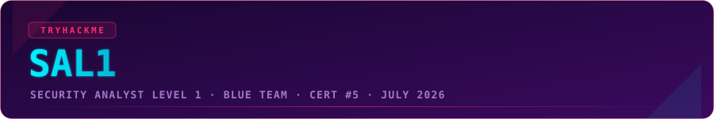
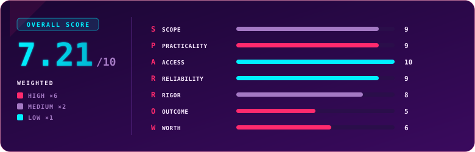

  

  
  
  
  

## Overview

> [!NOTE]
> **TL;DR** SAL1 (Security Analyst Level 1) is TryHackMe's entry-level, hands-on SOC analyst certification, built with Accenture and Salesforce. Three parts: 80 theory questions, then two SOC simulations, one tuned and one deliberately chaotic, graded on how well you triage, correlate, and report. Blue team is where I live, and on the fundamentals this exam did not stand a chance. I passed with 996/1000 on the first attempt in about two and a half hours. It is the best "does this person actually understand SOC work" exam I have taken. The two things holding it back are both about the market rather than the exam: recognition is still building, and the price is high enough that I raised it directly with the TryHackMe team. Weighted score: **7.21 / 10**.

  

## Exam Parameters

| Parameter | Detail |
|---|---|
| Full name | Security Analyst Level 1 (SAL1) |
| Built with | Accenture, Salesforce and JustEat, validated with senior analysts |
| Format | Three parts: multiple-choice theory, then two SOC simulations with report grading |
| Part 1 | 80 theory questions across SOC operations, networking, MITRE ATT&CK, incident response and malware analysis |
| Part 2 | SOC simulation, tuned: a tighter alert queue weighted toward genuine incidents |
| Part 3 | SOC simulation, chaos: a looser, noisier, more realistic queue |
| Tooling | SIEM (Splunk), an analyst VM, and an IP/URL/file reputation tool |
| Exam window | 24 hours to complete at your own pace |
| Scoring | Out of 1000 (I passed with 996) |
| Retake | 1 free retake included |
| Price | €301 with training, or €256 for existing Premium/Max subscribers |
| Learning included | 3 months of premium access to the Cyber Security fundamentals and SOC Level 1 paths |
| Positioning | TryHackMe lists it from $297, against CySA+ from $391 and BTL1 at $399 |

## Terrain

SAL1 is built in three movements, and they escalate in a way that mirrors how you actually grow into the job.

Part one is 80 theory questions. This is the part people fixate on and it is the least interesting, by design. It is concrete analyst knowledge, the frameworks and fundamentals you lean on every shift, and pointedly not the "which of these four vendor products is best" trivia that other entry certs lean on. It is a fragment of the exam and it is meant to be.

The two SOC simulations are where SAL1 earns its name. The first is tuned: a tighter queue where most of what lands is a genuine incident, so you spend your time on focused triage and building the picture rather than sifting. Having a scenario that is almost all true positives is oddly unsettling once you are used to real queues, and that tension is part of the fun. The second simulation is the opposite, and it is the highlight. It is looser, noisier and far more realistic: one connected escalation chain to unravel, a handful of independent attacks that are not all successful, and enough background noise that you have to think. Working from the walkthrough of both, the tasks are an honest reflection of real analyst work. You are building timelines in the SIEM, correlating separate alerts into a single story, telling benign Windows discovery chatter apart from real lateral movement, and following attacker behaviour across the full lifecycle from initial access through to exfiltration. Then you write it up. It is the closest an exam has come, for me, to sitting a real shift.

I hold CompTIA's analyst-level cert too, and the contrast is the whole point. They target the same level, but CySA+ is a quiz: multiple choice, trick wording, pure theory, and for me a bit of a roulette wheel because I cannot stand "name the product that does X" questions. SAL1 has its quiz section, but it is the practical halves that make it shine.

## Mission Debrief

I knew I was walking in to pass this one. After SEC1 I could already see SAL1 would sit comfortably inside what I do day to day, and blue team has been the centre of my work for years. If anything my nerves were saved for SAL2, which had so little written about it online that I did not know what to expect. SAL1 was the opposite: a known quantity that I was quietly confident about. The 996 still landed differently than I expected, because it was a clean read on how comfortable incident response has become for me.

My preparation was the day job plus the full SOC Level 1 path, and I rate the path highly. It is very well put together and, in my view, covers the exam material completely, with the SOC simulator bolted on for practice. If I am honest the simulator ran a little slow for my pace, because I move quickly at work and would rather get to the projects, so my advice for anyone with some experience is to start a lab, go and do something else for half its runtime, and come back once the alerts have finished arriving.

## Friction Points

> [!WARNING]
> **The alert queues fill in real time, and the interface does not let you merge related alerts.** In the simulations, alerts stream in gradually rather than all at once, so watching them arrive one by one wastes time you could spend triaging in a batch. The bigger papercut is that when several alerts belong to the same incident, you cannot attach them to an existing case and add insight, so I ended up copying my own answers between related alerts to avoid rewriting the same reasoning repeatedly. Neither is a dealbreaker, and the Splunk data stayed fully populated the entire time, which reinforced every call I made. A merge-into-existing-alert feature would make the report-writing flow noticeably smoother.

## Debrief Accounting

The reports are graded by AI, and I want to be measured about what that means, because it is the one place rigor gets soft. In practice it rewarded the right things. I did not write anything elaborate and still took near-full marks; what mattered was classifying each alert correctly, and using the specific evidence in front of me to justify why I called it the way I did, all at a sensible pace. My four missing points I cannot fully account for, and my honest read is that they are a small AI-grading mismatch rather than a real gap, so I treat 996 as a maximum.

On preparation, the SOC Level 1 path aligns with the exam about as tightly as a path can, which is why Access scores where it does. The knowledge I brought from outside the course was the years on the job in defensive roles, which is what let me move quickly through the queues and read the noise for what it was.

## S.P.A.R.R.O.W. Score

| Letter | Dimension | Weight | Score | Reasoning |
|:---:|---|:---:|:---:|---|
| **S** | Scope | ×2 | 9 | It advertises entry-level SOC analyst work, and the three-part exam plus path deliver exactly that, theory through full-lifecycle triage and reporting. |
| **P** | Practicality | ×6 | 9 | The two SOC simulations are the closest thing to a real analyst shift I have sat in an exam, timeline building, correlation and genuine noise; only the theory section is less hands-on. |
| **A** | Access | ×1 | 10 | The SOC Level 1 path is excellent and, with the built-in simulator, covers the exam completely. |
| **R** | Reliability | ×1 | 9 | The Splunk data stayed fully populated throughout and the environment held up with no issues on my run. |
| **R** | Rigor | ×2 | 8 | Theory grades cleanly and the report grading rewarded evidence-backed calls, though AI-graded write-ups leave a little unpredictability, as my own unaccounted-for points show. |
| **O** | Outcome | ×6 | 5 | A genuine SOC-analyst signal that beats the SEC line for recognition, but it is still newer and less known than PT1 and sits between SEC1 and SAL2 in the market's eye. |
| **W** | Worth | ×6 | 6 | You get a strong exam plus full path access and a free retake, but the price runs high for an entry-level cert, high enough that I flagged it to TryHackMe as a recognition risk. |

### Overall score: 7.21 / 10

| Tier | Weight | Scores | Weighted subtotal |
|---|:---:|---|:---:|
| High | ×6 | Practicality 9, Outcome 5, Worth 6 → sum 20 | 120 |
| Medium | ×2 | Scope 9, Rigor 8 → sum 17 | 34 |
| Low | ×1 | Access 10, Reliability 9 → sum 19 | 19 |

`(120 + 34 + 19) / 24 = 173 / 24 = 7.21`

> [!TIP]
> Read the shape of this score carefully, because the exam is better than the number looks. Practicality is a 9 and the low-weight craft marks are near perfect. The two things pulling it down, Outcome and Worth, are both about the market and not the assessment: a recognition curve that is still climbing, and a price tag that is high for the tier. Neither is something you experience while sitting the exam, and both can move in the cert's favour with time and pricing.

## Verdict

Take SAL1 if you want to prove you can do the job rather than recite it, and especially if you are aiming at a SOC or blue-team role. It is the most faithful simulation of real analyst work I have met in a certification, and against the obvious alternative it is telling that TryHackMe prices it below CySA+ while including the hands-on SOC experience CySA+ does not. Where I would pause is on money and timing. The price sits high for an entry-level credential, and the cert is caught in an awkward middle for now, not as heavyweight as SAL2 nor as recognised as PT1, so if a name an HR filter already scans for is your only goal, weigh that. For everyone who wants the skills and the closest thing to shift experience you can buy, this is an easy recommendation, ideally caught on a discount.

## Lessons Learned

- Start simulations two and three, then step away for a while. The alerts arrive over roughly an hour, and batch-triaging what has landed beats watching them trickle in.
- Let the evidence write your justification. Near-full marks came from correct classification plus the specific data that supported each call, not from elaborate prose.
- Copy your reasoning as you go. With no way to merge related alerts, having your own notes to hand saves you rewriting the same analysis across a connected chain.
- Treat the theory as the warm-up and bank your time for the simulations, which is where the score and the learning both live.

## Certificate

  

  

### My Result

| | |
|---|---|
| Score | 996 / 1000 |
| Time used | 2h 24m 46s |
| Attempt | 1 (passed first try) |
| Date | 18 July 2026 |
| Overall feel | Comfortable, and the cleanest score in my collection |

---

  

  Use code <code>KAROL20</code> on <a href="https://tryhackme.com/certification/security-analyst-level-1"><b>SAL1</b></a> or <a href="https://tryhackme.com/certifications?view=bundles"><b>BUNDLES</b></a> for 20% off

---

  

  
  
  

