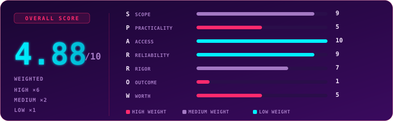

  

  
  
  
  

## Overview

> [!NOTE]
> **TL;DR** - SEC0 is TryHackMe's entry point cert: foundational IT and computer literacy before security concepts even start. Verdict below: worth it for a first cert, skip if you already work in the field.

  

## Exam Parameters

General facts about the cert itself, not about how I personally did (that's further down, next to the certificate).

| | |
|---|---|
| Full name | TryHackMe Pre Security Certification (SEC0) |
| Position in pathway | Entry point, base of the TryHackMe cert ladder, feeds into SEC1 |
| Format | Hands-on, scenario-based (not multiple choice) |
| Maximum score | 600 |
| Pass threshold | 390 / 600 |
| Time allowed | 24 hours |
| Retake | 1 free retake included |
| Validity | 3 years |
| Price (new user / no subscription) | €59, includes 3 months of access to select learning paths |
| Price (existing Premium/Max subscriber) | 15% discount off the standard price |

## Terrain

Six domains on paper: Computer Fundamentals, Operating Systems, Software Basics, Network Fundamentals, How the Web Works, Cyber Security: Attacks & Defenses.

In practice it reads as help desk territory: locating a host, checking who is logged in, reading an IP, understanding basic network layout. The kind of knowledge a lot of people already carry just from years of actually using a computer for more than browsing. Nothing here goes deep on any single domain. It is a wide but shallow pass across everything you would need before a "real" security concept makes sense at all, similar to confirming someone knows how to hold a scalpel before they touch a patient.

That is not a criticism, it is a scope decision, and TryHackMe is upfront about it: SEC0 explicitly does not claim job readiness. It is closer to a pre-helpdesk credential than a cyber one. The interesting design choice is that it is still scenario based rather than pure recall. You are placed in small simulated situations and asked to act, not asked to define a term. That format alone puts it a notch above most "fundamentals" multiple choice tests on the market, even if the content ceiling is low.

Who this actually lands differently for: someone who has spent 10+ years around a keyboard will find this almost entirely muscle memory. Someone coming in cold, with no prior IT exposure at all, will genuinely learn something in every domain. The cert does not distinguish between those two audiences. The experience does.

## Mission Debrief

- **Time invested:** years of general IT/PC use going in, plus roughly a week working through the Pre Security learning path (legacy version) beforehand.
- **Approach:** worked through the topics in order, no reordering, no pausing to research anything outside the platform.
- **Pacing:** built to be taken in one sitting, over a coffee, not to demand a weekend the way WEB1 did.
- **Turning point:** none of the dramatic kind, and that is the point, not a gap in the writeup. This is a fast, low friction loop: short tasks, quick wins, one after another. Nothing here demands a second read of the scenario, and inventing a "big reveal" moment for the sake of the narrative would misrepresent what the cert actually is.

## Friction Points

> [!WARNING]
> Twice during the exam, the expected answer format was not clear. Genuinely unsure whether the answer wanted `HOSTNAME` or `HOSTNAME.DOMAIN` (or another variant), with no format hint in the question text. Both times cost a few minutes of guessing rather than solving. Reported it to TryHackMe. By the time SEC1 was attempted, the format expectations were spelled out much more clearly in the question wording, a good sign the feedback loop between candidates and the exam team actually works, rather than issues sitting unaddressed across cert generations.

## Debrief Accounting

- **Grading fairness:** fair, once the answer-format issue above is accounted for. It cost time, not understanding, so it should not meaningfully affect the score, and it did not here.
- **Learning path alignment:** the Pre Security path (legacy + current) matched the exam content and then some, over-prepared rather than under-prepared. If anything, the path goes slightly deeper than the exam ever asks for.
- **Outside knowledge required:** none. Everything needed was covered in the path. No prior IT background is strictly required to pass, though it clearly helps with speed.

## S.P.A.R.R.O.W. Score

Full methodology and weighting logic: [main README](../README.md#methodology-sparrow-score). Each dimension scored 1-10.

| Letter | Dimension | Weight | Score | Reasoning |
|:---:|---|:---:|:---:|---|
| **S** | Scope | Medium | 9/10 | Coverage is close to 1:1, but the prep material actually goes a bit deeper than the exam ever tests, so it's slightly more than promised rather than an exact match |
| **P** | Practicality | High | 5/10 | Builds the instinct of knowing where data comes from, but most of it is automated by SIEM/SOAR/XDR today |
| **A** | Access | Low | 10/10 | Legacy and current Pre Security paths are a solid theory+practice mix, most of it free |
| **R** | Reliability | Low | 9/10 | No major issues, but the exam screen reloaded unexpectedly once in a while during the attempt, a minor hiccup rather than a blocker |
| **R** | Rigor | Medium | 7/10 | The answer-format confusion happened twice, not once, which is enough to genuinely dent trust in the grading, not just a one-off fluke |
| **O** | Outcome | High | 1/10 | Unrecognized on the job market, reads as first-computer-use or help desk training, not a cyber signal |
| **W** | Worth | High | 5/10 | The underlying knowledge here is genuinely common and freely findable elsewhere in structured form (YouTube courses, free IT fundamentals content, community docs), so paying anything is already a discretionary choice. €59 for a new user does bundle 3 months of access to real learning paths, which makes it a fair price for what's included, but it's not exceptional given how replicable the content is without paying at all |

### Overall score: 4.88 / 10

| Weight tier | Multiplier | Dimensions | Scores | Weighted subtotal |
|---|:---:|---|---|:---:|
| High | x6 | Practicality, Outcome, Worth | 5, 1, 5 | 66 |
| Medium | x2 | Scope, Rigor | 9, 7 | 32 |
| Low | x1 | Access, Reliability | 10, 9 | 19 |

Total weighted sum 117, over total weight 24, gives **4.88/10**.

> [!TIP]
> **Reading the score:** high Scope/Access/Reliability with low Outcome/Worth is the expected shape for an entry cert like this. It means TryHackMe built exactly what they said they would build, it is just early on the ladder. Don't read the low numbers as "bad cert," read them as "correctly positioned as step one," which is also why the weighting favors Practicality, Outcome and Worth: those are the numbers that actually change your decision.

## Verdict

If you are starting from zero certs, first job after school, or switching in from a completely unrelated field, get it. It is cheap, low effort, and gives you a real "watch me start growing in this direction" marker. If you already work in cyber, skip it unless you are collecting badges for the sake of it.

## Lessons Learned

- Answer-format ambiguity in early TryHackMe exams is worth flagging. They iterate on it, SEC1 confirmed this.
- This cert is a floor, not a differentiator. Treat it as a checkpoint, not a learning goal.

## Certificate

  

  

### My Result

| | |
|---|---|
| Score achieved | 580 / 600 |
| Time used | 1h 08m 47s of the 24h allowed |
| Attempt | 1st attempt |
| Overall feel | Easy |

---

  

  Use code <code>KAROL20</code> on <a href="https://tryhackme.com/certification/pre-security/details"><b>SEC0</b></a> or <a href="https://tryhackme.com/certifications?view=bundles"><b>BUNDLES</b></a> for 20% off

---

  

  
  
  

