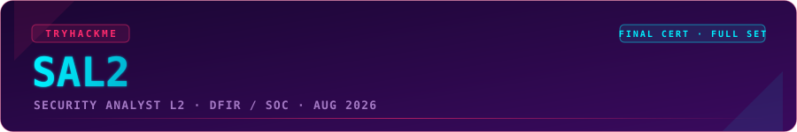
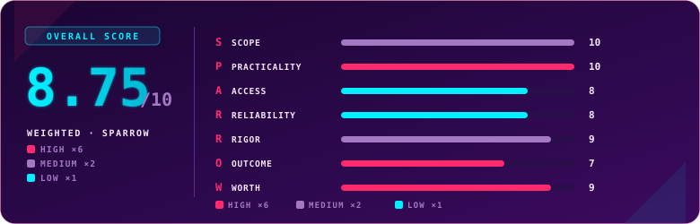

  

  
  
  
  

## Overview

> [!NOTE]
> **TL;DR** — SAL2 is the most complete, production-ready cert TryHackMe has shipped. Twelve fully hands-on SOC scenarios across three shifts, graded on technical depth *and* decision-making, reporting, prioritisation, and SLA awareness. It rewards people who can read the data instead of the story around it. For a working blue-teamer it feels like home turf; for someone without a blue foundation it's a wall. This was the last cert in my set, so I went in for a no-pause speedrun, and it still earned every point. Weighted **8.75 / 10**.

  

## Exam Parameters

| Item | Detail |
|---|---|
| Full name | Security Analyst Level 2 (SAL2) |
| Position in path | Advanced defensive tier, recommended after SAL1 |
| Format | Hands-on, scenario-based (no multiple choice) |
| Structure | 12 scenarios, in 3 shifts of 4. Finish a shift before moving to the next; scenarios inside a shift can be done in any order |
| Time | 72-hour window for the whole exam, but each scenario is individually time-boxed (roughly 1–2h once started), plus a per-scenario SLA timer |
| Pass mark | 65% |
| Grading split | Technical analysis 60% · report writing / decision making 40% |
| Bonuses | +15% of a scenario's points for hitting SLA, +5% for correct severity prioritisation. Applied *before* the final percentage, so they can flip a pass/fail |
| Retake | One free retake included |
| Validity | Exam attempts valid 12 months from purchase |
| Price | ~$510 for Premium subscribers · ~$657 without membership (learning path modules bundled) |

## Terrain

SAL2 advertises itself as covering "every domain a real L2 analyst faces," and for once the marketing is accurate. Across the twelve scenarios you touch SIEM work in both Elastic and Splunk, threat intelligence and CTI (MISP), live host forensics on Windows and Linux, network traffic analysis, static malware triage, email phishing, cloud incidents in both AWS (CloudTrail) and M365/Entra, Windows AD investigation, web log analysis, alert triage on an EDR console, and detection engineering with Sigma. Each scenario pairs the technical dig with either a decision-making task or a client-facing report.

The thing that defines the terrain is that it does not test tool trivia. It tests judgement. Almost every scenario has a trap baked in that looks like a signal but isn't: a traffic surge that reads like a game launch but is actually a DDoS, a "failed recon" that didn't mean nothing happened because a webshell was quietly returning 200s underneath it, timestomped file dates, a Proton VPN login the briefing explicitly warns you not to dismiss as a false positive, cryptographic OIDs that look like IP addresses in a strings dump. The difficulty is not the tooling. It is refusing to answer from the briefing and instead proving every answer against a specific event, process, or packet.

Who it lands differently for: if you already do SOC/DFIR work, this is your day job in exam form and it moves fast. If you are strong on offense but light on blue (as some reviewers were), you can still pass by leaning on attacker-mindset pattern recognition, but it is not a beginner cert and it is not where you start blue team.

## Mission Debrief

I took this as the final cert in my collection, so the framing was deliberate: sit down, start it, and don't get up until it's done. One attempt, 5h42m of actual work, no pause. That pace is only sane because SOC/DFIR is the area I invest the most time in, at work and privately, and teach as a mentor, so the muscle memory was already there.

The method never changed across all twelve: evidence before the answer. Never from the briefing, never from a hunch, always from the log line, the process tree, or the packet. That discipline paid off constantly, most sharply in the moments where the first hypothesis was wrong and only expanding the data corrected it. A "brute force on Administrator" that turned out to be one link in a full domain-compromise chain once you expanded the process tree. A first recommendation that flipped from "disruption" to "distraction from the real breach" the moment a webshell's 200 response showed up. The scenarios reward the analyst who keeps pulling the thread instead of calling the verdict on event one.

> The turning point, if there was one, was internalising that "outage is not the objective, it can be the method," and that "recon failed" (404/400) never means "nothing happened." Those two reframes carried several scenarios.

## Friction Points

> [!WARNING]
> Most of the friction is environmental, not fatal. Nothing here broke the exam permanently, but a few things cost time for the wrong reasons and are worth knowing going in.

- **Field-mapping and parsing quirks.** The first Elastic scenario returned nothing until I realised the host was in `agent.name`, not `host.hostname`. A Falco scenario came through as unparsed JSON, 14k noise events deep. Event Viewer XML filters fought me over timezones (the `Z`/UTC suffix blocked matches until removed). AAD audit operation names came with naming variations that a narrow filter silently misses.
- **Detection-engineering validator.** In the Sigma tuning scenario the validator rejected `count()` aggregation and parenthesised `condition` grouping, even though the platform docs list aggregation as supported. Worth knowing so you don't burn attempts on syntax the engine won't run.
- **Report ≠ logs.** In several scenarios the narrative in the briefing/report didn't match what the raw telemetry actually showed. That's arguably intentional (the whole point is to trust data over story), but it's a friction point if you take the briefing at face value.

None of it was exam-breaking. The machines themselves were stable and deploy times sensible, which is the part that matters most and a clear step up from what THM exams used to feel like.

## Debrief Accounting

Grading is demanding and, importantly, transparent about how it works. Technical questions are all-or-nothing per question: correct earns full points, wrong earns zero, no partial credit, so a confident wrong answer is strictly worse than a careful "I can't prove this." The 40% on reporting and decision-making is where the cert separates analysts from button-pushers, and it's assessed on set criteria rather than a vibe check. The one thing I'd have liked back is personalised feedback on the written portion, the results page gives you a skill matrix but not line-by-line notes, so you learn where you scored, not exactly why.

The two bonuses are the sting in the tail. SLA adherence adds 15% of a scenario's points if you finish in time, and prioritisation adds 5% for triaging in correct severity order (Critical → High → Medium → Low). Both apply before the final percentage, so they genuinely move pass/fail. I lost ground on case prioritisation for a dumb reason: I worked the scenarios in the order presented rather than by severity. It stung, but it's a fair test. Real L2 work *is* prioritisation, and the exam is right to grade it.

On prep alignment: the SOC L2 path covers the core (Splunk, Elastic, log analysis, detection engineering), and it's genuinely possible to pass leaning mostly on it. But the exam clearly rewards outside experience. Recognising Redis RCE abuse as a textbook pattern, or knowing Akira ransomware on sight, came from prior reading and work, not from the path. The exam set a higher bar than the training material historically has, which is a good problem, and the direction of travel is right.

## S.P.A.R.R.O.W. Score

Scored 1–10 per dimension, then weighted. Full definitions and weighting live in the [repo methodology](../README.md#methodology-sparrow-score).

| Letter | Dimension | Weight | Score | Reasoning |
|:---:|---|:---:|:---:|---|
| **S** | Scope | ×2 | 10 | Advertised as covering every L2 domain, and the twelve scenarios genuinely deliver the full spectrum: SIEM, CTI, host forensics (Win + Linux), PCAP, cloud, AD, phishing, malware, detection engineering. Coverage matches the promise. |
| **P** | Practicality | ×6 | 10 | The strongest dimension by far. Real SOC simulations, real-time alerts, mandatory client reports, SLA scoring. As someone who writes these reports for a living, it mirrors the actual job more closely than any cert I've taken. |
| **A** | Access | ×1 | 8 | The SOC L2 path covers the core and is enough to pass, but the exam clearly rewards experience picked up outside the course. Prep is solid; it just isn't the whole picture. |
| **R** | Reliability | ×1 | 8 | Machines were stable and deploy times sensible, but there was real friction: unparsed Falco JSON, timezone filter quirks, and a Sigma validator that rejects documented syntax. Annoying, cost time, but nothing exam-breaking. |
| **R** | Rigor | ×2 | 9 | Penalties for wrong answers, and grading on depth, communication *and* prioritisation, not just task completion. The case-prio hit stung but it's a real L2 skill being tested fairly, not a gotcha. |
| **O** | Outcome | ×6 | 7 | Deliberately measured. THM recognition is rising but still limited next to OSCP/GIAC/BTL2, and the cert is only months old. The hands-on realism signals genuine capability, but HR isn't filtering on SAL2 yet. |
| **W** | Worth | ×6 | 9 | For a long time it looked expensive to me. Then I saw the breadth of material and how the exam itself is built, compared it to BTL2 and peers, and changed my mind. At ~$510/$657 with modules, a retake and 12-month validity bundled, it's fair value. |

### Overall score: 8.75 / 10

| Tier | Weight | Scores | Weighted subtotal |
|---|:---:|---|:---:|
| High | ×6 | Practicality 10, Outcome 7, Worth 9 → sum 26 | 156 |
| Medium | ×2 | Scope 10, Rigor 9 → sum 19 | 38 |
| Low | ×1 | Access 8, Reliability 8 → sum 16 | 16 |

`(156 + 38 + 16) / 24 = 210 / 24 = 8.75`

> [!TIP]
> The shape tells the story: near-perfect where it counts most (Practicality and the heavily-weighted craft of the thing), held back only by Outcome, the one dimension that isn't about the exam's quality but about how much the market currently recognises it. That's a timing problem, not a design problem. As THM's blue-team recognition catches up, this is a cert whose score will age upward.

## Verdict

Take SAL2 if you're a SOC/DFIR analyst ready to prove you operate at L2: cross-domain investigation, sound decisions under an SLA clock, and reports a client would actually accept. It is, in my opinion, the best cert on the platform and the first that feels like a finished, cohesive product rather than a good exam wrapped in rough edges. Skip it, for now, if you don't have a blue-team foundation, it's explicitly not a beginner cert, and start with SAL1 instead. The only thing I'd weigh separately from the exam is recognition: it's a strong hands-on credential, but it's young, so buy it to prove and sharpen real capability, not as a name an HR filter will already know. On the merits that actually matter, the skills it demands and demonstrates, it's excellent.

## Lessons Learned

- **Evidence before the verdict, every single time.** The recurring trap across all twelve scenarios was the plausible-but-wrong first read. The fix was never cleverness, it was refusing to answer until a specific event, process, or packet backed it.
- **Prioritise by severity, not by list order.** The 5% prioritisation bonus and 15% SLA bonus are not garnish, they move pass/fail. Triage Critical → High → Medium → Low from the start.
- **"Failed recon" and "outage" are not conclusions.** A 404 doesn't mean nothing happened, and an outage can be the smokescreen, not the goal. Always check what's quietly succeeding underneath the noise.
- **Trust the telemetry over the narrative.** When the briefing or report disagrees with the raw logs, the logs win. Build detections and conclusions on what the data actually shows.

## Certificate

  

  

### My Result

| | |
|---|---|
| **Score** | 86% (pass mark 65%) |
| **Time used** | 5h42m13s |
| **Attempt** | 1st |
| **Overall feel** | Home turf. All in or nothing. |

This was the final cert in the collection, which (confirmed with TryHackMe's admin team, as of 07.08.2026) makes me the first user on the platform to hold the complete set. That milestone is a big part of why this one mattered.

---

  

  Use code <code>KAROL20</code> on <a href="https://tryhackme.com/certification/security-analyst-level-2"><b>SAL2</b></a> or <a href="https://tryhackme.com/certifications?view=bundles"><b>BUNDLES</b></a> for 20% off

---

  

  
  
  

