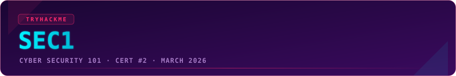
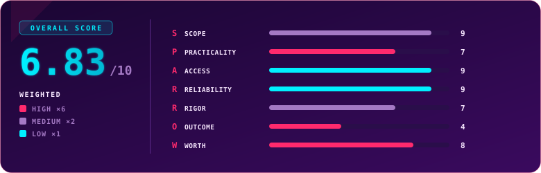

  

  
  
  
  

## Overview

> [!NOTE]
> **TL;DR** SEC1 (Cyber Security 101) is TryHackMe's foundational, fully hands-on certification. Seven sections, each worth 100 points, spanning Windows, Linux, network traffic, web pentesting, security operations, bruteforcing and cracking, and malware analysis. No multiple choice, no AI grading, just find the answer and type it in. It was the first certification I ever earned, and the one that convinced me cyber should be tested by doing, not by memorising menu options. Broad, fair, well priced. The only thing holding it back is that it is new, so recognition is still catching up. Weighted score: **6.83 / 10**.

  

  

  Use code <code>KAROL20</code> on <a href="https://tryhackme.com/certification/cyber-security-101"><b>SEC1</b></a> or <a href="https://tryhackme.com/certifications?view=bundles"><b>BUNDLES</b></a> for 20% off

## Exam Parameters

| Parameter | Detail |
|---|---|
| Full name | Cyber Security 101 (SEC1) |
| Format | Fully hands-on, scenario-based. No multiple choice, no AI grading. Answers typed into text boxes. |
| Sections | 7, one per topic, 10 questions each, 100 points each (700 total) |
| Topics | Windows, Linux, Network Traffic, Web Pentesting, Security Operations, Bruteforcing and Cracking, Malware Analysis |
| Per-section time | 30 to 60 minutes depending on the section |
| Exam window | 24 hours to complete at your own pace |
| Pass score | 455 / 700 |
| Retake | 1 free retake included |
| Environment | Unproctored, open book. Windows and Linux targets, some over VPN, some pre-built machines |
| Price | €131 standard, roughly €111 with the 15% Premium/Max discount |
| Bundle | SEC0 + SEC1 bundle for €152 (20% off each) |
| Learning included | 3 months of premium access to the Pre Security and Cyber Security 101 paths |

## Terrain

SEC1 is built like a tasting menu of the whole field. The seven sections are self-contained, each is scored out of 100, and each one drops you into a different corner of cyber: hardening and administering Windows and Linux, reading network traffic, pentesting a web app, working a SOC-style investigation, cracking credentials, and pulling apart a piece of malware.

The depth here is a real step up from SEC0. This is the point where the material stops being "click the checkbox" and starts to feel like the first hour of an actual job. It is fundamentals, but fundamentals-plus: enough of each discipline that you leave with an honest read on where you are strongest. That is the quiet value of the cert. It is less about the badge and more about telling you whether you lean Windows or Linux, red or blue, malware analysis or infrastructure and networking. For a total beginner it is a genuine hands-on challenge. For someone with a few years behind them it is a broad, comfortable sweep that still surfaces a favourite. Mine turned out to be web pentesting, which I did not expect going in.

## Mission Debrief

My preparation was a mix of the day job and TryHackMe. At the time of writing I am about four years into cyber. I moved across internally from an Identity and Access Management team, so I already knew my way around IT before I specialised, and most of what I learned early came from colleagues and from TryHackMe itself. The old standalone path that has since been folded into Cyber Security 101 is genuinely what pointed my thinking in the right direction and let me build real competence in the field. Today I work as an architect, manager and mentor in cyber, and I can trace a straight line back to that path.

The exam itself I sat in one sitting, section by section, and finished in about three and a half hours.

## How It Went

SEC1 was, historically speaking, my first certification attempt but officially my second in terms of final certificate date. Let me explain.

I took my first attempt on 1 March 2026 and passed. This was a huge moment for me - my first TryHackMe certification and my first real hands-on exam in my life, not some multiple-choice quiz about what button does what in a specific tool. I remember the excitement clearly. It cemented something I already believed: the IT world, especially cybersecurity, should reward practice over trivia. "What is the name of the option in application X to do Y?" Looking at you, CompTIA.

The second attempt on 7 March 2026 happened entirely by accident. I clicked "retake" just to read the conditions, and the timer started instantly. Panic set in - I wasn't sure if ignoring it would revoke my original cert -so I sat down and passed again. Two passes, one accidental proof that the exam is repeatable.

## Friction Points

> [!WARNING]
> **The retake button starts the timer immediately, with no confirmation step.** If you only want to read the retake conditions, know that clicking through can commit you to a live attempt. One other thing to plan around: the details page advertises a 24-hour window while the seven sections only add up to about seven hours, which is confusing when you are scheduling your day. And a small number of answers can come down to exact formatting, so read what each field is asking for.

## Debrief Accounting

Grading felt fair. The large majority of questions came with clear references for what to enter, so there was much less second-guessing than in SEC0. I have two questions I suspect I got wrong, inferred from one section's point total, and I could probably argue the toss on them. But the pass was comfortable enough that I did not want to spend support's time on a recheck over a hunch. I saved that card for a later exam.

On prep alignment, the Cyber Security 101 path covers around 95% of what the exam asks. The thin spot is DFIR, which could use a little more practice than the path alone gives you; that gap is better served now by the dedicated blue-team paths. One honest weakness on the exam side: a few of the Linux administration tasks are shallow, leaning on repeated `grep` and `cat`, with little depth beyond basic file reading. The knowledge I brought from outside the course was mostly the four years on the job and the IAM background, which helped with the Windows and identity-flavoured tasks.

## S.P.A.R.R.O.W. Score

| Letter | Dimension | Weight | Score | Reasoning |
|:---:|---|:---:|:---:|---|
| **S** | Scope | ×2 | 9 | It advertises broad entry-level fundamentals across seven domains, and the exam genuinely tests all seven hands-on. |
| **P** | Practicality | ×6 | 7 | Real pentest, incident-response, forensics and admin tasks that mirror day-one work, though a fair amount of the heavy lifting is carried by tooling like SIEM and SOAR. |
| **A** | Access | ×1 | 9 | The bundled Cyber Security 101 path covers the vast majority of the exam, with only DFIR needing extra practice. |
| **R** | Reliability | ×1 | 9 | The exam ran smoothly for me from start to finish, with no platform issues during my run. |
| **R** | Rigor | ×2 | 7 | Deterministic text-box grading is fair and mostly unambiguous, but a couple of answers hinge on formatting and some questions are simple enough to test recall more than analysis. |
| **O** | Outcome | ×6 | 4 | Recognition is still emerging and Security+ dominates hiring, but SEC1 is starting to appear in EU job ads and reads well to hands-on hiring managers. |
| **W** | Worth | ×6 | 8 | Around €111 with the Premium discount buys a broad seven-domain exam plus months of learning access and a free retake, strong value even though much of the material is free elsewhere. |

### Overall score: 6.83 / 10

| Tier | Weight | Scores | Weighted subtotal |
|---|:---:|---|:---:|
| High | ×6 | Practicality 7, Outcome 4, Worth 8 → sum 19 | 114 |
| Medium | ×2 | Scope 9, Rigor 7 → sum 16 | 32 |
| Low | ×1 | Access 9, Reliability 9 → sum 18 | 18 |

`(114 + 32 + 18) / 24 = 164 / 24 = 6.83`

> [!TIP]
> The shape of this score is a strong cert with one anchor pulling it down, and that anchor is Outcome, not quality. Scope sits at 9, Worth at 8, so the exam does what it claims and is priced fairly. The 4 on Outcome is simply the cost of being new: give the market another year and this number climbs on its own.

## Verdict

Take SEC1 if you are early in cyber or switching in from another part of IT and you want an honest, broad, hands-on tour to find your lane. It is the best "which part of this field am I actually good at" exam I know of at this price, and it rewards doing over memorising, which is exactly the right lesson to learn first. Skip it, for now, if the only thing you need is a name an HR filter already recognises, because Security+ still wins that specific fight. Everyone else: this is a genuinely enjoyable exam and a smart first or second step, especially bundled with SEC0.

## Lessons Learned

- A hands-on exam tells you where you belong faster than any quiz. I walked in expecting to lean blue and walked out knowing web pentesting is my strong lane.
- Read the retake mechanics before you click anything. The timer does not wait for you to be ready.
- Breadth-first certifications are underrated early. Sampling every domain de-risks the bigger decision of what to specialise in.
- Save your notes locally. The in-exam notepad is handy but wipes the moment the exam ends.

## Certificate

  

  

### My Result

| | |
|---|---|
| Score | 570 / 700 (pass mark 455) |
| Time used | 3h 23m 15s |
| Attempt | 2 (both attempts passed, the second was an accidental retake) |
| Dates | Passed 1 March 2026, re-passed 7 March 2026 (official date) |
| Overall feel | Enjoyable |

---

  

  
  
  

