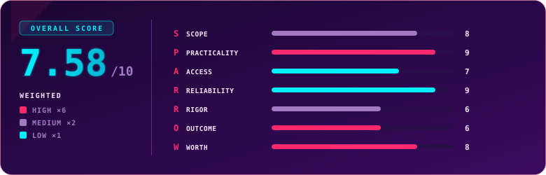

  

  
  
  
  

## Overview

> [!NOTE]
> **TL;DR** WEB1 (Web Application Pentester Level 1) is TryHackMe's focused web pentesting certification: one 48-hour engagement across three access models, blackbox, whitebox and greybox, scored on per-vulnerability flags plus a short report for each finding. After PT1 taught me that web is my hardest and most rewarding ground, WEB1 handed me the same lesson again. I crushed the blackbox and whitebox sections at around 98% each inside the first hour, then walked straight into a greybox wall that cost me nearly 46 hours, a night's sleep, and a human review before it accepted my pass at 741. It is a genuinely strong, non-standard exam, and the newest cert in my collection, and it is already the one I saw in other people's CVs more than once! Weighted score: **7.58 / 10**.

  

  

  Use code <code>KAROL20</code> on <a href="https://tryhackme.com/certification/web-application-pentester-level-1"><b>WEB1</b></a> or <a href="https://tryhackme.com/certifications?view=bundles"><b>BUNDLES</b></a> for 20% off

## Exam Parameters

| Parameter | Detail |
|---|---|
| Full name | Web Application Pentester Level 1 (WEB1) |
| Format | One hands-on web engagement plus a short report per vulnerability found |
| Sections | Blackbox (20% of points), Whitebox (20%), Greybox (60%) |
| Scoring | 1000 points total; each flag is 70% exploitation, 30% write-up (vuln name, attack description, remediation) |
| Pass mark | 700 / 1000 (70%) |
| Exam window | 48 hours, at your own pace |
| Environment | Provided AttackBox or your own VPN-connected machine; no paid tooling (Burp Pro) required |
| Appeal | Written scores can be appealed to a human reviewer |
| Retake | 1 free retake included |
| Price | $299, or roughly $254 for existing Premium subscribers (15% off) |
| Learning included | 3 months of Premium; all exam content comes from the Web Application Pentesting path |
| Positioning | A focused web specialisation that sits before PT1 as pre-preparation, despite running into intermediate territory |

## Terrain

WEB1 is one long web engagement cut into three access models, and the split is the smartest thing about it.

The blackbox section puts you in the shoes of an external attacker with no source and no credentials, working only from what the application exposes. The whitebox section flips that entirely: you get full access, including source, and the work becomes code-review-driven, tracing flaws back to the lines that cause them. In both of those sections, a single flag plus its write-up was enough to clear the part, and I finished them at roughly 98% each within about the first hour. It felt like a walk in the park, and I was genuinely excited, because that pace was direct proof of how much I had learned since PT1.

Then comes greybox, which is 60% of the entire exam and a completely different animal. It is the collision with reality. This is where WEB1 stops being a Level 1 anything and starts demanding the intermediate material the syllabus quietly lists: request smuggling, race conditions, insecure deserialisation, prototype pollution, the modern web attack surface in full. The findings expect non-standard thinking, and the flag is where the points live. Working from my own exam report, the tasks are engaging, they reward creativity, and they are an honest reflection of real web assessment work, the kind where the interesting bug and the flag that proves it are not always in the same place.

## Mission Debrief

This was my longest exam by far, 45 hours and change, and the first time I deliberately built recovery into the window. I slept, and midway through I went out with friends to an outdoor escape room to reset my head, which is the single healthiest thing I have done during any of these. I took it on a Saturday, so the only person around to bounce a thought off was Liza <3 (hi, and thank you: https://www.linkedin.com/in/ekrud/), and even then I knew better and do not want to drag people away from their weekend to untangle my exam.

The greybox stretch is the story. In the first few minutes I turned up a strange artifact that was clearly not a real flag, and I had no way to know if it was a hint, a bug, noise, or an easter egg, so I noted it and moved on. My first real flag did not land until about four hours in, and the PT1 flashbacks arrived. More hours bought me a second flag. The third, fourth and fifth never showed. I found several other things that did not resolve into flags, then circled back to that early oddity and finally broke it open, and it turned out to be a genuinely powerful exploit that handed me full control of the target, exactly the kind of finding you want, but still no flag attached. I turned the room over to the very end and knew the maths did not close: the flag carries the points, and without it I needed one of my unflagged findings to be accepted on the report alone. I came up short, but short by little enough that if the bug I had fully exploited was credited its flag, I passed. On the Tuesday, the review did exactly that, added the flag, and the result was accepted at 741 with no doubt about it. The other findings I filed as bugs, though some may well be out of scope or noise.

There is a small curse I cannot shake: two missing flags on red-team-flavoured exams, the same thing that happened to me on PT1 and CAPen. I still do not know whether the last two here were somewhere I never looked or simply were not there for me. Either way, I passed, and after PT1 I had said out loud that web was my hardest and most rewarding section. WEB1 made that true twice over.

## Friction Points

> [!WARNING]
> **The flag carries so much of each finding that a real, fully-exploited bug can still leave you short.** Because exploitation is 70% of a finding and the write-up only 30%, missing the flag means missing most of the points even when you found the vulnerability, understood it, and could exploit it at will. I lived this: a powerful, valid finding with no flag attached is what kept me under the line until a human credited it. My wish for the exam is a small rescue field, even 500 characters of "here is what else I found," so a legitimate discovery can earn partial credit through the report when the flag does not register. It would need to be designed carefully so nobody dumps a wall of speculative exploits, but as it stands the flag-to-write-up gap feels a touch too wide.

## Debrief Accounting

Grading is deterministic where it should be and appealable where it needs to be: flags verify exploitation objectively, and the written attack description and remediation are marked against a published rubric with a human appeal path behind them. That appeal path was decisive for me, and I want to be honest that it should not always have to be. My exploitation was real and my write-ups were solid, yet the automated result sat me just under the line until a person confirmed the finding and credited the flag. It worked, quickly and without argument, but the weighting is what put me in that position in the first place.

On preparation, I had worked the recommended material and labs and I passed, but I finished genuinely unsure whether the path takes you all the way to a maximum score. I felt like I had dug through everything I knew and still could not place the last flags, which tells me the exam reaches a little past where the path comfortably leaves you. For context on value, the point split here is steeper than PT1's, where the flag and the write-up sat much closer together, so a miss on WEB1 stings more than the same miss would have on the red-team exam.

## S.P.A.R.R.O.W. Score

| Letter | Dimension | Weight | Score | Reasoning |
|:---:|---|:---:|:---:|---|
| **S** | Scope | ×2 | 8 | It promises focused web pentesting across blackbox, whitebox and greybox and delivers all three with real reporting, though the greybox difficulty stretches the "Level 1" label. |
| **P** | Practicality | ×6 | 9 | Three genuine access models, findings that demand non-standard exploitation, and a per-vulnerability report make it a faithful slice of real web assessment work. |
| **A** | Access | ×1 | 7 | The recommended path and labs were enough to pass, but I finished unsure they carry you to a maximum score, so expect to reach beyond them for every flag. |
| **R** | Reliability | ×1 | 9 | Across my longest exam, nearly 46 hours, the isolated per-candidate environment stayed stable with no issues I noticed. |
| **R** | Rigor | ×2 | 6 | Flags verify exploitation objectively and write-ups follow a published rubric, but the flag is weighted so heavily that a valid, fully-exploited bug left me short until a human appeal credited it. |
| **O** | Outcome | ×6 | 6 | Newer than PT1, yet already the cert I see most in CVs and write-ups, and it assesses whitebox review that pricier rivals skip, so its market signal is climbing fast. |
| **W** | Worth | ×6 | 8 | For around $254 with the discount you get a three-model web exam, path access and a free retake, and it tests whitebox source review that no rival under four figures touches. |

### Overall score: 7.58 / 10

| Tier | Weight | Scores | Weighted subtotal |
|---|:---:|---|:---:|
| High | ×6 | Practicality 9, Outcome 6, Worth 8 → sum 23 | 138 |
| Medium | ×2 | Scope 8, Rigor 6 → sum 14 | 28 |
| Low | ×1 | Access 7, Reliability 9 → sum 16 | 16 |

`(138 + 28 + 16) / 24 = 182 / 24 = 7.58`

> [!TIP]
> The number rides on a strong exam with one lopsided edge. Practicality, Worth and a near-perfect Reliability carry it, and the whitebox section is a genuine differentiator that even far pricier web certs leave out. What holds it back is Rigor: a flag-to-write-up split so steep that a real finding can fail to score until a human steps in. The appeal path already exists, so a gentler weighting or a small partial-credit field is all this needs to climb.

## Verdict

Take WEB1 if web is your lane and you want to be tested across all three ways a real assessment happens, not just the external view. It is the rare exam that grades a whitebox source review at all, let alone at this price, it rewards creative exploitation over checklist-running, and it pairs naturally as the web-depth step before PT1. Set expectations in two places: the greybox section is intermediate despite the "Level 1" badge, so do not let the name trick you, focus on your preparation, and understand that the flag carries the finding, so a bug you cannot flag will hurt even when your exploitation and write-up are excellent. For anyone serious about application security who wants proof that runs deeper than a quiz, this is a strong, satisfying exam, and its early visibility on the market suggests it is going to matter.

## Lessons Learned

- Build rest into the 48 hours on purpose. Sleep and a real break away from the screen did more for my results than another hour of staring would have.
- Chase the flag, not just the bug. A brilliant exploit with no flag attached is most of a finding's points left on the table.
- Use the written appeal when your exploitation is sound. Mine turned a near-miss into a clean pass without any argument.
- Treat "Level 1" as a floor, not a ceiling. Greybox expects intermediate techniques, so prepare past the recommended path.
- Keep a running note of every finding as you go, flagged or not, so nothing you discovered is lost when you assemble the report.

## Certificate

  

  

### My Result

| | |
|---|---|
| Score | 741 / 1000 (pass mark 700, accepted after review) |
| Time used | 45h 44m 42s, my longest exam yet |
| Attempt | 1 (passed, with the deciding flag credited on human review) |
| Dates | Sat 24 July 2026, result accepted 26 July 2026 |
| Overall feel | Hardest and most rewarding section of my whole collection, confirmed second time |

---

  

  
  
  

